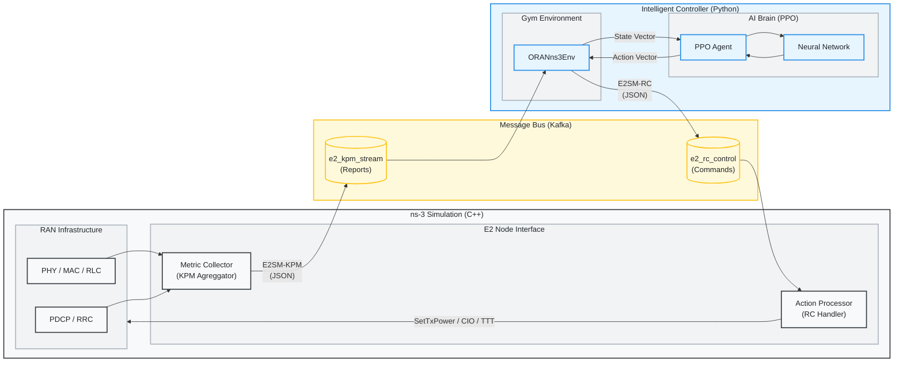

# Radio-Cortex: O-RAN RL Congestion Control

Radio-Cortex is a closed-loop control system that uses Reinforcement Learning (RL) to optimize network parameters (Tx Power, CIO, TTT) in an O-RAN compliant ns-3 simulation. It features a real-time feedback loop where an RL agent (PPO) receives KPM (Key Performance Metrics) from ns-3 via Kafka and sends back RC (RAN Control) actions, with a live Rich TUI dashboard and per-step KPM verification logging.

### 🏆 Key Innovations & Solved Challenges
Radio-Cortex pushes the boundary of O-RAN intelligence by solving three fundamental problems in applying RL to wireless networks:

1.  **Baby Dragon Hatchling (Scale-Free Transformer)**:
    -   *Problem*: Standard Neural Networks require fixed input sizes (breaking when UEs join/leave). Furthermore, standard Transformers use "Causal Masking," which blinds early tokens (Cells) from seeing later tokens (UEs).
    -   *Solution*: We adapted the **Baby Dragon Hatchling (BDH)** architecture into a **Scale-Free Transformer** policy. By removing the causal mask, we allow Base Stations to fully "attend" to all User tokens simultaneously, regardless of their position in the sequence. This creates a truly **Scale-Free Agent** that trains on 5 UEs but successfully controls 100 UEs without retraining.

2.  **Stationary Reward Engine (Distributed-RL Safe)**:
    -   *Problem*: Multi-stage curriculum rewards create non-stationary MDPs that destabilize distributed training (SubprocVecEnv). Conflicting reward components (energy, queue, smoothing) introduce gradient noise and reward hacking.
    -   *Solution*: A **single-stage, flat reward function** with 7 components: **Throughput** (log-fairness), **Delay** (linear), **Packet Loss** (linear penalty), **Load Balancing** (CIO-driven), **Energy Efficiency** (Tx Power Regularization), **SLA Bonus**, and **CIO Regularization**. A constant `+1.0` survival bias keeps rewards positive. All penalties are linearly bounded with per-component and total clipping to prevent gradient explosions.

3.  **Cell-Centric Action Space (Physics-Informed Control)**:
    -   *Problem*: RL agents often output erratic "bang-bang" control actions if the action space is poorly defined. 
    -   *Solution*: We utilize a **9-dimension action space** (3 per cell: TxPower, CIO, TTT). 
        *   **TxPower**: Absolute mapping from [-1, 1] to [10, 46] dBm for direct energy-performance control. 
        *   **CIO**: Absolute mapping from [-1, 1] to [-6, 6] dB for immediate load balancing via handover boundary adjustment.
        *   **TTT**: Inverse mapping from [-1, 1] to [1280, 0] ms to control handover agility vs. stability.
    All actions are absolute and physics-bounded, restoring causality and ensuring the agent learns stable policies. 
    The **State Space** utilizes 48 features per cell (12 base + 3 delta + 1 stationary flag, frame stacked × 3) yielding 144 inputs per cell.

## 🚀 End-to-End Installation Guide

For a complete, automated setup on Linux:
```bash
# 1. Clone the Repositories
git clone https://github.com/ishreyanshkumar/Radio-Cortex.git
cd Radio-Cortex
 
# 2. Run the End-to-End Setup Script
# This will:
# - Create a virtual environment (.venv)
# - Install dependencies
# - Clone and Build ns-3 (Optimized)
# - Link scenarios
# - Start Kafka
bash scripts/setup.sh
```
 
---
 
### Manual Installation Steps (Alternative)
 
If the script fails or you prefer manual control, follow these steps:
 
### 1. Clone the Repositories
```bash
# Clone the main project
git clone https://github.com/ishreyanshkumar/Radio-Cortex.git
cd Radio-Cortex
 
# Clone ns-allinone (Official Gitlab Repository)
git clone https://gitlab.com/nsnam/ns-3-allinone.git
cd ns-3-allinone
./download.py ns-3.46.1
cd ..
```
 
### 2. Set up Python Virtual Environment
```bash
# Create venv in the parent directory (or project root)
python3 -m venv .venv
 
# Activate the virtual environment
source .venv/bin/activate
 
# Install dependencies
pip install -r requirements.txt
```
 
### 3. Build ns-3 & Link Scenario
ns-3 requires specific libraries (like `librdkafka`) for the O-RAN interface to work.
```bash
# 1. Install librdkafka (system-level)
sudo apt-get install librdkafka-dev
 
# 2. Link the Radio-Cortex scenario into ns-3 scratch (MUST be done before build)
cd ns-3-allinone/ns-3.46.1/scratch
rm -rf *  # CLEANUP: Remove default examples to avoid build conflicts
ln -sf ../../../oran-congestion-scenario.cc .
ln -sf ../../../CMakeLists.txt .  # Link CMakeLists to register the scenario
cd ..

# 3. Configure and Build ns-3
./ns3 configure -d optimized --enable-examples --enable-tests
./ns3 build
```
 
### 4. Running the Training
 
#### A. Bootstrap & Start Kafka
Kafka and Zookeeper must be running for the E2 interface to function. If this is a fresh setup, use the bootstrap script:
```bash
bash scripts/run_kafka_native.sh
```
*Note: This will download Kafka binaries, install `librdkafka-dev`, and start the services.*

For subsequent starts, you can use:
```bash
./scripts/start_kafka.sh
```

#### B. Start Training
```bash
# Ensure venv is active
source .venv/bin/activate
```

## 🛠️ Utilities

The `scripts/` directory contains multi-language utilities to assist with development:

- **Cleanup**: `bash scripts/cleanup.sh` - Removes logs, residuals, and caches.
- **Curriculum Training**: `bash scripts/train_curriculum.sh` - 8-stage progressive "Lean Power Suite".
- **Log Analyzer (Go)**: `go run scripts/log_analyzer.go`

---

## 🎮 Usage & Workflows

### Advanced Training Configuration
You can customize the training hyperparameters and environment settings via command-line arguments. Radio-Cortex uses organized argument groups to separate core operations from network settings and advanced tuning.

#### 1. Core Operation
| Argument | Default | Description |
|:---|:---|:---|
| `--mode` | `train` | Operation mode: `train` or `eval`. |
| `--scenario` | `flash_crowd` | ns-3 Scenario (12 available). Use `all` for random rotation. |
| `--total-timesteps` | 100000 | Total training or evaluation steps. |
| `--n-envs` | 12 | Number of parallel environments (vectorized). 12-16 recommended for BDH. |
| `--model` | `bdh` | Policy architecture: `bdh` (Transformer), `nn` (MLP), `t1` (Transformer-1), `t2` (Transformer-2). |
| `--model-path` | `models/radiocortex_{model}.pt` | Path to save/load model checkpoint. |
| `--device` | `None` | Compute device (`cpu` or `cuda`). |
| `--config` | `None` | Path to JSON config file to override any argument. |

#### 2. Network & Environment
| Argument | Default | Description |
|:---|:---|:---|
| `--num-ues` | 20 | Number of User Equipments (UEs). |
| `--num-cells` | 3 | Number of cells (eNodeBs). |
| `--sim-time` | 20.0 | Simulation duration per episode (seconds). |
| `--kpm-interval` | 100 | KPM Reporting Interval in ms. |
| `--system-bandwidth-mhz` | 10.0 | System Bandwidth (5.0, 10.0, 20.0). |

---

#### 3. Advanced RL Tuning
| Argument | Default | Description |
|:---|:---|:---|
| `--learning-rate` | 3e-5 | PPO Learning rate. |
| `--batch-size` | 512 | Batch size for optimization updates. |
| `--rollout-steps` | 512 | Steps per rollout trajectory. |
| `--gamma` | 0.99 | Discount factor. |
| `--hidden-dim` | 256 | Network hidden dimension. |
| `--gae-lambda` | 0.95 | GAE normalization lambda. |
| `--clip-epsilon` | 0.1 | PPO clipping bound (Conservative). |
| `--vf-coef` | 0.5 | Value function loss weight. |
| `--ent-coef` | 0.03 | Entropy regularization weight. |
| `--max-grad-norm` | 0.5 | Gradient clipping threshold. |
| `--checkpoint-interval` | 10 | Checkpoint frequency (updates). |
| `--log-interval` | 10 | Console log frequency (updates). |
| `--ppo-epochs` | 20 | PPO update epochs per batch. |
| `--target-kl` | 0.05 | Target KL divergence for early stopping. |

## 🌍 Simulation Scenarios

Radio-Cortex supports 12 diverse scenarios that stress-test different aspects of RAN intelligence.

| Scenario | Type | Description | Key Metric |
| :--- | :--- | :--- | :--- |
| `flash_crowd` | Traffic | Sudden influx of users in one cell. | Congestion Intensity |
| `mobility_storm` | Mobility | High-speed users moving across cells. | HO Success Rate |
| `traffic_burst` | Traffic | Periodic surges in application data. | Peak Burst Loss |
| `handover_ping_pong` | Mobility | Users oscillating between cell boundaries. | HO Count per UE |
| `sleepy_campus` | Energy | Low-traffic night-time vs high-traffic day-time. | Energy Efficiency |
| `ambulance` | QoS | High-priority emergency stream in congested RAN. | Priority UE Delay |
| `adversarial` | Reliability | Rapid fluctuation in signal (shadowing). | Stability Score |
| `commuter_rush` | Scaled Mobility | Mass group handover (50+ UEs moving together). | RACH Failure Rate |
| `mixed_reality` | Slicing | Concurrent VR (Latent) and TCP (Bulk) users. | Slice Isolation |
| `urban_canyon` | PHY | Sudden signal blockage behind buildings. | Recovery Time |
| `iot_tsunami` | Scale | Massive device count (100+ UEs, small packets). | Scheduling Delay |
| `spectrum_crunch` | Resources | Multi-band management (Carrier Aggregation). | Aggregate Throughput |


## 🚀 CLI Training Reference

Train the O-RAN Intelligent Controller using PPO (Proximal Policy Optimization).

#### 1. 8-stage "Lean Power Suite" curriculum (Optimized for Speed)
```
bash scripts/train_curriculum.sh
```

Preview the plan without executing
```
bash scripts/train_curriculum.sh --dry-run
```

#### 2. Single Scenario Training
```bash
# General usage
python3 radio_cortex_complete.py --mode train --scenario <name> --total-timesteps 200000

# Example: Flash Crowd with 50 UEs
python3 radio_cortex_complete.py --mode train --scenario flash_crowd --num-ues 50 --total-timesteps 200000
```

#### 3. Parallel & Performance Training
```bash
# Run 16 parallel simulations on BDH (requires optimized build)
python3 radio_cortex_complete.py --mode train --scenario flash_crowd --model bdh --n-envs 16 \
    --total-timesteps 200000 --learning-rate 1e-4 --batch-size 512 --rollout-steps 256
```

#### 4. Advanced Hyperparameter Tuning
```bash
python3 radio_cortex_complete.py --mode train \
    --learning-rate 0.0001 \
    --gamma 0.995 \
    --batch-size 512 \
    --model-path models/custom_agent.pt
```

---

## 📊 CLI Evaluation & Benchmarking

Benchmarking compares the AI agent against the **Static-RAN** baseline. Results are appended to `results/experiment_results.csv`.

#### 1. Baseline Benchmark (AI disabled)
Run this first to establish a "ground truth" performance floor.
```bash
python3 radio_cortex_complete.py --mode eval --model base --scenario flash_crowd
```

#### 2. AI Agent Evaluation
```bash
# Evaluate the default BDH model on mobility storm
python3 radio_cortex_complete.py --mode eval --model bdh --scenario mobility_storm

# After curriculum training — point to the curriculum checkpoint
python3 radio_cortex_complete.py --mode eval --model bdh --scenario all --n-envs 4 \
    --model-path models/curriculum/stage_13.pt
```

#### 3. Comparing Specific Architectures
```bash
# Compare BDH vs MLP
python3 radio_cortex_complete.py --mode eval --model bdh --scenario flash_crowd
python3 radio_cortex_complete.py --mode eval --model nn --scenario flash_crowd
```

#### 4. Interaction & Results Visualization
View metrics, radar charts, and comparison tables.
```bash
# Standalone HTML
python3 -m http.server 8080
# Open http://localhost:8080/dashboard.html
```


## 📊 Detailed Evaluation Metrics

We categorize metrics based on the network layer they analyze, ensuring a holistic view of performance across the O-RAN stack.

### 🌐 Quality of Service (QoS / Application Layer)
* **Throughput (Mbps):** Average successful data delivery rate to UEs.
* **End-to-End Delay (ms):** Average time for a packet to travel from source to destination.
* **Satisfied User Ratio (%):** Percentage of users meeting the SLA:
    *   *SLA Criteria:* Throughput > 1 Mbps AND Delay < 100 ms.

### 🛡️ Reliability & Stability
*   **Packet Loss Ratio (%):** Ratio of lost packets to total sent.
*   **Handover Success Rate (%):** Successful / Attempted handovers.

### ⚡ Resource Efficiency (Spectrum & Network)
*   **Spectrum Utilization (%):** Average usage of Resource Blocks (RBs) across all cells.
*   **Congestion Intensity (%):** Percentage of time where network utilization > 90%.
*   **Cell Edge Throughput (Mbps):** 5th Percentile throughput. Indicates how well the network serves users with poor coverage (fairness).
*   **Jain's Fairness Index (0-1):** Measures how equally resources are shared. 1.0 = perfect equality.
    *   *Formula:* $(\sum x_i)^2 / (n \cdot \sum x_i^2)$ where $x_i$ is UE throughput.
*   **Energy Efficiency (Mbps/Watt):** System Throughput / Total Power Consumption. Measures the "cost" of transmitting data.


### 📶 PHY / Wireless Layer
*   **Average SINR (dB):** Signal-to-Interference-plus-Noise Ratio.
*   **Average RSRP (dBm):** Reference Signal Received Power (Signal Strength).

### 🚀 Mobility Metrics
*   **Handover Count:** Number of cell switches per UE.

### 🖧 RIC / E2 Interface Metrics
*   **Control Stability (%):** 0-100 score measuring AI "jitter". High score means stable decisions; low score means frequent, large action changes.

### 🧠 Architecture & Compute Metrics
*   **Inference Time (ms):** Average time taken by the agent to compute an action. Critical for comparing model architectures (e.g., Transformer vs MLP) against O-RAN real-time constraints.

---

#### 2. Composite Health Scores (Radar Chart)

To provide a quick "Health Check" of the network, we aggregate metrics into **6 composite scores** (0-100).

### 🏆 1. QoS Score (User Experience)
Combines how fast, responsive, and consistent the network felt to users. Includes tail-latency (p95) to capture stuttering.
*   **Formula:** `25% Throughput + 25% Delay + 15% p95 Delay + 35% Satisfied Users`

### 🛡️ 2. Reliability Score (Stability)
Penalizes both constant loss, sudden outages (Peak/Max Loss), service downtime, unstable mobility, and handover failures. Rewards fast recovery and stable control.
*   **Formula:** `35% Avg Loss + 15% Max Loss + 20% Downtime + 10% Avg HO Count/UE + 20% HO Success`
*   *Note:* Control Stability and HO Stability were removed from the composite formula to focus on physical metrics.

### 🏗️ 3. Resource Score (Efficiency & Fairness)
Rewards high spectrum utilization AND efficiency, while ensuring fairness.
*   **Formula:** `10% Utilization + 30% Cell Edge + 30% Jain's Fairness + 30% Energy Efficiency`
*   **Note:** Energy Efficiency acts as a tie-breaker, rewarding agents that achieve similar QoS with lower power.

### 📦 4. Buffer Score (Congestion Health)
Measures buffer occupancy and congestion spikes.
*   **Formula:** `60% Norm. Queue Length + 40% Congestion Intensity`

### 📡 5. PHY Score (Signal Quality)
Combined physical layer conditions.
*   **Formula:** `60% SINR + 40% RSRP`


### 🧠 6. Architecture Score (Model Efficiency)
Measures the "cost of intelligence" - how heavy the model is in terms of latency and sizing.
*   **Formula:** `50% Normalized Params + 50% Normalized Inference Speed`
*   **Penalties:** 
    *   0 score if Params > 1,000,000 (1M)
    *   0 score if Inference > 10ms (O-RAN SLA boundary)
    *   Baseline (Static) naturally scores 100 as it has 0 inference cost.


---

#### 3. Excluded Metrics & Limitations

The following metrics were considered but **not implemented** due to simulator constraints:

| Metric | Category | Reason for Exclusion |
| :--- | :--- | :--- |
| **Collision Rate** | Reliability | Requires MAC layer tracing with significant I/O overhead. |
| **Control Overhead** | Resource | Requires deep packet inspection, not feasible in real-time RL. |

---

## 🧠 Stationary Reward Engine

Radio-Cortex uses a **single-stage, stationary reward function** optimized for distributed RL training (SubprocVecEnv). A **Survival Bias** of `+1.0` keeps rewards positive during exploration.

#### Active Components

| Component | Weight | Formula | Range |
|:---|:---:|:---|:---:|
| **Throughput** | 8.0 | $W \cdot \log(1 + T/T_{max})$ | [-0.5, 50.0] |
| **Delay** | 4.0 | $-W \cdot \min(D/D_{max}, 1)$ (linear) | [-50.0, 0.0] |
| **Packet Loss** | 8.0 | $-W \cdot (\text{mean\_loss} \cdot 4)$ | [-25.0, 0.0] |
| **Load Balance** | 4.0 | $-\text{std}(\text{cell\_loads}) \cdot W$ | [-2.0, 0.0] |
| **Energy Eff.** | 0.1 | $-\text{mean}(\text{norm\_tx\_power}) \cdot W$ | [-1.0, 0.0] |
| **SLA Bonus** | 0.5 | +0.5 per UE meeting SLA (>1Mbps, <100ms) | [0.0, +NumUEs*0.5] |
| **CIO Regularization**| 0.4 | $-W \cdot \text{mean}(\|\text{CIO}\|/6)$ | [-0.4, 0.0] |
| **Survival Bias** | — | Constant `+1.0` | — |

$$R_{total} = \text{clip}\left( r_{tput} + r_{delay} + r_{loss} + r_{load} + r_{energy} + r_{sla} + r_{cio} + \text{BIAS}, [-100, 50] \right)$$

---

## Interpretability
Understand which input features (e.g., Queue Length vs Throughput) drove the agent's decisions.
```bash
python3 interpret_policy.py --checkpoint models/radio_cortex.pt
```

---

## 📂 Codebase Structure & Documentation

### 1. `radio_cortex_complete.py`
**Role:** Main Entry Point & Orchestrator.
This script manages the lifecycle of the training process, initializes the agent, and runs the main loop.

*   **`main()`**: Entry point. Parses arguments (`--mode train/eval/demo`) and routes execution.
*   **`train_radio_cortex(config, ...)`**: The core training loop.
    *   Creates the environment (`create_oran_env`).
    *   Initializes the `PPOTrainer`.
    *   Executes the training steps (rollout collection -> policy update).
    *   Saves the model to `models/radio_cortex.pt`.
*   **`RadioCortexAgent`**: High-level agent class.
    *   `get_rl_action()`: Queries the neural network for an action.
    *   `_heuristic_action()`: Fallback logic rule if RL is disabled.

### 2. `oran_ns3_env.py`
**Role:** Gymnasium Environment Wrapper.
converts ns-3 simulation into a standard OpenAI Gym interface (observation, action, reward).

*   **`ORANns3Env`**: The Gym Environment class.
    *   `step(action)`: Takes an RL action (9 dims = 3 per cell), sends it to ns-3, waits for the next KPM report, and returns (state, reward, done).
    *   `reset()`: Restarts the ns-3 simulation subprocess.
    *   `_compute_reward(e2_msg)`: Delegates to `RewardEngine`.
    *   **`RewardEngine`**: Stationary single-stage reward engine. Combines 6 components (Throughput, Delay, Loss, Load, Energy, SLA Bonus) with Survival Bias.
    *   **State Space**: `num_cells × 48` (3-frame stacked Enriched Cell Tokens). Features strictly normalized to [-1, 1]. Includes a stationary flag instead of curriculum level.
    *   **Action Space**: `num_cells × 3` = 9 dimensions. All [-1,1]-normalized.
        *   **TxPower**: Absolute mapping to [10, 46] dBm. Allows instant power switching.
        *   **CIO**: Absolute [-6, 6] dB.
        *   **TTT**: Absolute [0, 1280] ms.
*   **`NS3Interface`**: Handles low-level communication.
    *   `start_simulation()`: Spawns the `./ns3 run ...` subprocess.
    *   `send_rc_control(actions)`: Serializes actions to JSON and sends via Kafka `e2_rc_control` topic.
    *   `receive_kpm_report()`: Polls Kafka `e2_kpm_stream` topic for metrics.

### 3. `rl_training_pipeline.py`
**Role:** Reinforcement Learning Algorithms (PPO).
Implements the PPO algorithm from scratch using PyTorch.

*   **`PPOTrainer`**: Implementation of PPO logic.
    *   `collect_rollout()`: Interacts with the env to gather a batch of experiences.
    *   `compute_gae()`: Calculates Generalized Advantage Estimation for stable learning.
    *   `update_policy()`: Performs the Gradient Descent update steps on the Actor and Critic networks.

### 4. Policy Architectures Supported:
All policies use **state-dependent exploration** (learned log-std heads) for adaptive exploration.

*   **BDH** (Default): Baby Dragon Hatchling (Scale-Free Transformer) — Cell tokenization (12 features per cell), bidirectional self-attention across cells
*   **GPT-2** (`gpt2`): Standard Decoder-Only Transformer — Causal attention over time
*   **Transformer-XL** (`trxl`): Segment-Level Recurrence
*   **Linear Transformer** (`linear`): O(T) Kernel Attention (Katharopoulos)
*   **Universal Transformer** (`universal`): Weight Sharing
*   **Reformer** (`reformer`): Bucketed Attention
*   **MLP** (`nn`): Simple Feed-Forward Baseline

### 5. `interpret_policy.py`
**Role:** Model Interpretability.
Computes saliency maps (gradient * input) to understand which state features (e.g., UE throughput, Cell queue) influence the agent's decisions the most.

*   `_saliency()`: Backpropagates from the action mean to the input state.
*   usage: `python interpret_policy.py --checkpoint models/radio_cortex.pt`

### 6. `scripts/train_quick.sh`
**Role:** Fast Verification.
Runs `radio_cortex_complete.py` with minimal steps (100 timesteps) to verify the pipeline implementation quickly.

### 7. `oran-congestion-scenario.cc`
**Role:** ns-3 Simulation Scenario (C++).
The "Digital Twin" of the RAN. Implements the LTE/5G network, traffic generation, and E2 interface.

*   **`E2InterfaceManager`**: Manages the Kafka bridge.
    *   `SetupKafka()`: Configures `librdkafka` producer/consumer.
    *   `SendKpmReport()`: Collects metrics from all UEs, formats as JSON, and produces to Kafka.
    *   `ProcessRcCommand()`: Parses JSON control messages and applies changes (e.g., `SetTxPower`) to eNodeBs.
*   **`MetricCollector`**: Aggregates simulation traces.
    *   `ReportDlScheduling()`: Callback for DL MAC activity (estimates RB usage).
    *   `ReportAppRx()`: Callback for packet reception (calculates Delay).
    *   `GetAndResetUeMetrics()`: Returns accumulated stats and resets counters.

### 8. `evaluation_baseline.py`
**Role:** High-Fidelity Evaluation Framework.
Extracts metrics and evaluates trained models against the static baseline, computing the Composite Health Scores and Advanced Metrics.

### 9. `scripts/train_curriculum.sh`
**Role:** 8-Stage "Lean Power Suite" Curriculum.
Automates the progressive training of the RL agent from simple to complex congestion scenarios, managing storage and preventing catastrophic forgetting.

### 10. Visualization & Deployment (`ui/`, Docker)
**Role:** Interaction and Containerization.
*   **`ui/dashboard.html`** & **`ui/gradio_app.py`**: Rich visual dashboards for viewing metrics securely.
*   **`Dockerfile`** & **`docker-compose.yml`**: Full containerized deployment for Kafka, Zookeeper, and the compiled ns-3 Agent environment.

---

## 🔄 System Architecture



---

## 📋 Logs & KPM Verification

All debug and verification logs are stored in the `logs/` directory:

| File Pattern | Description |
|:---|:---|
| `logs/ns3_out_X.log` | Standard output from ns-3 simulation instance X. Includes E2 interface heartbeats. |
| `logs/ns3_err_X.log` | Standard error (debug logs) from ns-3 simulation instance X. Critical for debugging C++ crashes. |
| `logs/kpm_verification_X.jsonl` | Audit trail of raw vs reported KPM values for environment X, used to verify MetricCollector fidelity. |
| `results/simulation_data_*.db` | **Unified SQLite Database** containing all step traces (state/action/reward) and final evaluation results. Ideal for interactive visual playback and query-based analysis. |
| `logs/worker_failure_X.log` | Error tracebacks specifically for environment worker X if it fails to initialize. |

---

## 📺 Simulation Visualizer

Radio-Cortex includes a high-fidelity, web-based playback tool for analyzing agent behavior in simulation.

1.  **Locate Database**: Find the latest `simulation_data_*.db` in your `results/` directory.
2.  **Open Visualizer**: Open `ui/visualizer.html` in any modern web browser.
3.  **Load Data**: Drag and drop the `.db` file into the window (or use the "Load" button).
4.  **Analyze**: Use playback controls to step through the simulation, view real-time charts, and inspect per-cell control actions.

> [!TIP]
> This tool is entirely client-side (using **SQL.js**). No backend server is required — just open the HTML file and load your data.

---

## 📈 Training Dashboard Guide

| Metric | Target Trend | What it means |
|:---|:---:|:---|
| **Reward** | ↗ Growing | The agent is successfully reducing congestion and improving user QoS. |
| **Trend** | ↗ (Green) | Recent updates have improved performance by 5% or more. |
| **Expl Var** | → 0.9 | High values mean the agent correctly predicts the "cost" of its actions. |
| **Entropy** | ↘ Decreasing | The agent is narrowing down its optimal control strategy (good). |
| **Policy Loss** | ⇄ Oscillating | Normal in PPO; indicates the agent is exploring different tradeoffs. |

# KPM Report Reference

The Key Performance Metrics (KPM) report is a JSON object generated by the ns-3 simulation (`oran-congestion-scenario.cc`) and streamed to the RL agent via Kafka on the `e2_kpm_stream` topic. Ideally, this report is sent every 100ms (configurable via `kpmInterval`).

These reports provide a snapshot of the network state and utilize the E2SM-KPM (E2 Service Model for Key Performance Metrics) format.

## General Fields

| Field | Type | Description |
| :--- | :--- | :--- |
| `timestamp` | `float` | The current simulation time in seconds. |

## UE Metrics (User Equipment)

For each UE, keys are formatted as `ue_{id}_{metric}`.

| Metric Key Suffix | Unit | Range | Description |
| :--- | :--- | :--- | :--- |
| `_tput` | Mbps | 0.0 - 150.0 | Downlink Throughput. Calculated based on bytes received in the interval. |
| `_delay` | ms | 5.0 - 500.0 | Average Downlink Latency for packets received in the interval. |
| `_loss` | Ratio | 0.0 - 1.0 | Packet Loss Ratio. (Lost Packets / Total Packets). |
| `_sinr` | dB | -10.0 - 60.0 | Signal-to-Interference-plus-Noise Ratio. Linear average converted to dB. |
| `_rsrp` | dBm | -140.0 - -60.0 | Reference Signal Received Power. Indicates signal strength. |
| `_rsrq` | dB | -20.0 - 0.0 | Reference Signal Received Quality. Indicates signal quality. |
| `_cqi`  | Index | 0 - 15 | Channel Quality Indicator. Estimated from SINR. |
| `_rbs`  | count | 0 - 5000 | Number of Downlink Resource Blocks allocated over the interval. |
| `_ul_rbs`  | count | 0 - 5000 | Average Uplink Resource Blocks used. |
| `_cell` | ID | 0 - N (N=Cells-1) | The ID of the serving cell the UE is currently connected to. |
| `_ho_att`  | count | 0 - 5 | Number of handover attempts initiated in the interval. |
| `_ho_succ` | count | 0 - 5 | Number of successful handovers in the interval. |
| `_rsrp_var` | - | 0.0 - 100.0 | Variance of RSRP samples (High values indicate rapid shadowing). |
| `_rsrq_var` | - | 0.0 - 5.0 | Variance of RSRQ samples (High values indicate rapid fading). |
| `_buffer` | bytes | 0.0 | Buffer occupancy (Currently a placeholder returning `0.0`). |

## Cell Metrics (Base Stations)

For each Cell/eNodeB, keys are formatted as `cell_{id}_{metric}`.

| Metric Key Suffix | Unit | Range | Description |
| :--- | :--- | :--- | :--- |
| `_power` | dBm | 10.0 - 46.0 | Current Transmission Power. |
| `_load` | count | 0 - 50 | Number of active UEs served by this cell in the last interval. |
| `_avg_rb_req` | count | 0 - 5000 | Average total Resource Blocks requested per UE over the interval. |
| `_rb_util` | ratio | 0.0 - 1.0 | Resource block utilization (Now calculated from UE allocations). |
| `_queue` | count | 0 - 5000 | Queue length (Estimated from per-cell packet loss). |
| `_ues` | count | 0 - 50 | Number of connected UEs in this cell. |

## Example JSON Payload

```json
{
  "timestamp": 12.5,
  "ue_0_tput": 5.2,
  "ue_0_delay": 15.4,
  "ue_0_loss": 0.0,
  "ue_0_sinr": 18.5,
  "ue_0_rsrp": -85.0,
  "ue_0_rsrq": -10.5,
  "ue_0_cqi": 12.0,
  "ue_0_rbs": 25.0,
  "ue_0_ul_rbs": 10.0,
  "ue_0_cell": 1,
  "ue_0_ho_att": 0,
  "ue_0_ho_succ": 0,
  "ue_0_rsrp_var": 0.5,
  "ue_0_rsrq_var": 0.1,
  "ue_0_buffer": 0.0,

  "cell_0_power": 43.0,
  "cell_0_load": 4,
  "cell_0_avg_rb_req": 15.0,
  "cell_0_rb_util": 0.75,
  "cell_0_queue": 150,
  "cell_0_ues": 4
}
```


# Complete Model Analysis

This document provides a comprehensive analysis of the reinforcement learning models found in the `models/` directory. The metadata (parameter counts, training steps, layer architectures) is extracted **directly from the `.pt` checkpoint files** rather than relying on prior documentation.

## 📊 Summary Table

| Model | File Size (MB) | Total Params | Timesteps Trained | Hidden Dim | Architecture |
| :--- | :--- | :--- | :--- | :--- | :--- |
| **BDH** | 72.94 | 6,418,451 | 983,040 | 512 | BDH |
| **GPT2** | 36.96 | 3,234,323 | 1,000,000 | 256 | GPT-2 Style Transformer |
| **LINEAR** | 36.89 | 3,217,939 | 1,000,000 | 256 | Linear Attention Transformer |
| **REFORMER** | 37.05 | 3,232,019 | 1,000,000 | 256 | Reformer Transformer |
| **TRXL** | 36.62 | 3,195,155 | 1,000,000 | 256 | Transformer-XL |
| **UNIVERSAL** | 9.73 | 851,475 | 1,000,000 | 256 | Universal Transformer |
| **NN** | 1.62 | 140,563 | 1,000,000 | 256 | 2-layer MLP Baseline |


---

## 🔬 Per-Model Detailed Metadata

### 1. BDH 
- **File Size:** 72.94 MB
- **Total Parameters:** 6,418,451
- **Timesteps Trained:** 983,040
- **Hyperparameters:**
  - `hidden_dim`: 512
  - `lr`: 3e-05 (stable learning rate config)
  - `batch_size`: 512, `rollout_steps`: 512, `n_envs`: 48
  - `clip_epsilon`: 0.1, `vf_coef`: 1.0
  - Entropy annealing: `ent_coef_start`: 0.03 → `ent_coef_end`: 0.005 (`ent_decay_fraction`: 0.8)
- **Key Architecture Characteristics:**
  - Uses an independent `logstd_head`: [1, 9] mapped to 9 action spaces.
  - Scale-free slot-based memory mapping inside the `encoder`: [4, 128, 4096] (4 heads, 128 dim, 4096 keys) and `decoder`: [16384, 128].

### 2. GPT2
- **File Size:** 36.96 MB
- **Total Parameters:** 3,234,323
- **Timesteps Trained:** 1,000,000 
- **Hyperparameters:** `hidden_dim`: 256, `lr`: 0.0005, `batch_size`: 512, `rollout_steps`: 512, `n_envs`: 48
- **Key Architecture Characteristics:**
  - `pos_embed`: [1, 64, 256] contextual sequence embedding for sequential state representations.
  - State projection block utilizes an initialized size of `state_embed.weight` [256, 144].

### 3. LINEAR (Linear Attention Transformer)
- **File Size:** 36.89 MB
- **Total Parameters:** 3,217,939
- **Timesteps Trained:** 1,000,000 
- **Hyperparameters:** `hidden_dim`: 256, `lr`: 0.0005, `batch_size`: 512, `rollout_steps`: 512, `n_envs`: 48
- **Key Architecture Characteristics:**
  - Standard autoregressive linear attention mechanisms. Identical input mapping block to the GPT2 backbone via `pos_embed`: [1, 64, 256] and `state_embed.weight`: [256, 144]. 

### 4. REFORMER
- **File Size:** 37.05 MB
- **Total Parameters:** 3,232,019
- **Timesteps Trained:** 1,000,000 
- **Hyperparameters:** `hidden_dim`: 256, `lr`: 0.0005, `batch_size`: 512, `rollout_steps`: 512, `n_envs`: 48
- **Key Architecture Characteristics:**
  - Designed for much longer context sequence history. 
  - Notable distinction in position embedding sequence length - `pos_embed`: [1, 128, 256] (128 context tokens compared to 64 for GPT2/Linear)
  - Also utilizes independent `actor_logstd`: [1, 9] for log-based standard deviation bounding.

### 5. TRXL (Transformer-XL)
- **File Size:** 36.62 MB
- **Total Parameters:** 3,195,155
- **Timesteps Trained:** 1,000,000 
- **Hyperparameters:** `hidden_dim`: 256, `lr`: 0.0005, `batch_size`: 512, `rollout_steps`: 512, `n_envs`: 48
- **Key Architecture Characteristics:**
  - Standard TrXL blocks without hardcoded positional embeddings natively printed, but features the standard projection mappings such as `state_embed.weight`: [256, 144] and independent `actor_logstd`: [1, 9]. 

### 6. UNIVERSAL (Universal Transformer)
- **File Size:** 9.73 MB
- **Total Parameters:** 851,475
- **Timesteps Trained:** 1,000,000 
- **Hyperparameters:** `hidden_dim`: 256, `lr`: 0.0005, `batch_size`: 512, `rollout_steps`: 512, `n_envs`: 48
- **Key Architecture Characteristics:**
  - Uniquely features a fraction of the parameter count relative to other Transformer variants due to **weight-tied blocks** across depth.
  - Implements recurrent depth embeddings (`step_embed.weight`: [4, 256]) for depth conditioning. Uses standard `pos_embed`: [1, 64, 256].

### 7. NN (MLP Baseline)
- **File Size:** 1.62 MB
- **Total Parameters:** 140,563
- **Timesteps Trained:** 1,000,000
- **Hyperparameters:** `hidden_dim`: 256, `lr`: 0.0005, `batch_size`: 512, `rollout_steps`: 512, `n_envs`: 48
- **Key Architecture Characteristics:**
  - The lightest model mapping observations using simple dense mappings (`feature_net.0.weight`: [256, 144] and `feature_net.2.weight`: [256, 256]) then linearly mapped independently to an `actor_mean` [9, 256] vector.


# 🔬 Advanced Workflows

### Scenario Curriculum (8-Stage "Lean Power Suite")
The curriculum script trains on progressively harder scenarios with automated inter-stage storage cleanup.

```bash
# Start the full 8-stage curriculum
bash scripts/train_curriculum.sh

# Resume from a specific stage (e.g., Stage 5)
bash scripts/train_curriculum.sh --start 5
```

**Core Principle**: Gradual introduction of complexity while maintaining exposure to mastered scenarios to prevent **catastrophic forgetting**.

**Key Strategy**: 
- Start with 100% on easiest scenario (Flash Crowd).
- Add new scenarios progressively via weighted mixing.
- Keep exposure to previous scenarios as a "maintenance dose".
- Focus majority of training on the newest/hardest targets.

| Stage | Focus | Total-timesteps | Skill Description |
|:---:|:---:|:---:|:---|
| 1 | Flash Crowd | 400k | Basic load balancing (Bootstrap) |
| 2 | Sleepy Campus | 450k | Energy efficiency (Green RAN) |
| 3 | Urban Canyon | 500k | Signal recovery & Robustness |
| 4 | Mobility Storm | 550k | Handover Optimization |
| 5 | Traffic Burst | 600k | Congestion Management |
| 6 | Ambulance | 650k | QoS Priority & Slicing |
| 7 | Spectrum Crunch | 700k | Spectral Efficiency |
| 8 | Generalization Mix | 1000k | Multi-goal Mastery |

**Total: ~1M timesteps** to full multi-domain mastery. *(Note: Test `ping_pong` and `iot_tsunami` for zero-shot generalization after training)*

### Batch Experiments (Terminal)
Run multiple evaluations on different models efficiently:
```bash
for model in bdh nn linear; do
    echo "Evaluating $model"
    python3 radio_cortex_complete.py --mode eval --model $model --scenario all
done
```