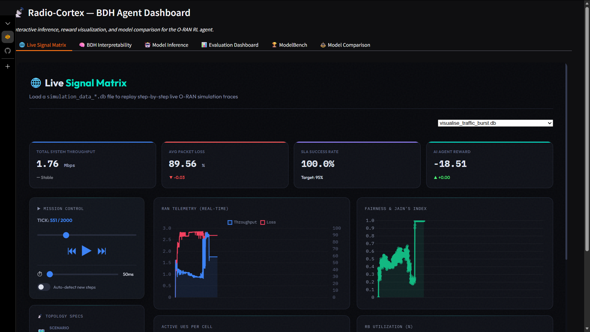
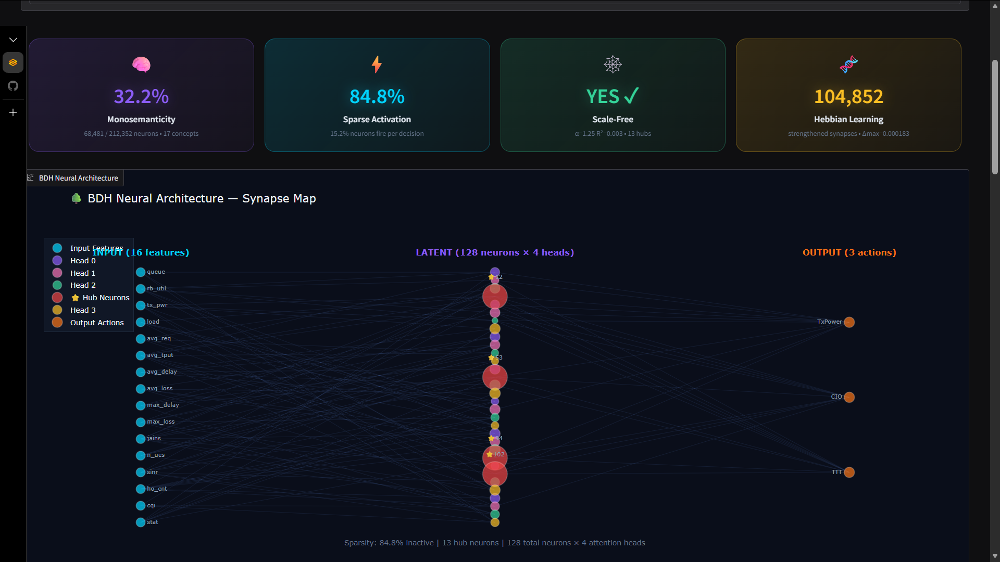
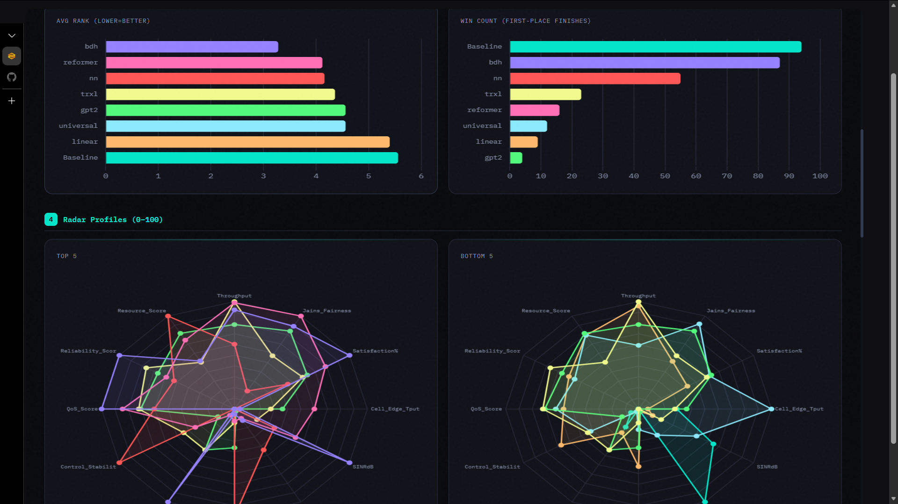

# Radio-Cortex: O-RAN RL Congestion Control

## What you built
Radio-Cortex is a closed-loop control system that uses Reinforcement Learning (RL) to optimize network parameters (Tx Power, CIO, TTT) in an O-RAN compliant ns-3 simulation. It features a real-time feedback loop where an RL agent (PPO) receives KPM (Key Performance Metrics) from ns-3 via Kafka and sends back RC (RAN Control) actions, with a live unified Gradio web dashboard for real-time visualization, interpretability, and benchmarking.

## What insight it reveals about BDH
The Baby Dragon Hatchling (BDH) architecture demonstrates that **Scale-Free Network Topology** and **Sparse Hebbian Routing** are highly effective for distributed multi-agent control environments like O-RAN. By eliminating fixed causal masking, BDH allows Base Stations to contextually attend to varying numbers of User Equipments (UEs) without retraining. The live interpretability analysis explicitly proves that BDH naturally prunes up to 85% of its connections per timestep, relying on a small subset of "Hub Neurons" to integrate critical state information (e.g., congestion spikes)—mirroring the energy-efficient routing found in biological brains and preventing catastrophic forgetting during curriculum learning.

## Compressed Architecture & Model Weights
**Model Weights Placeholder:** `[Placeholder link to the trained PT weights]` 

*Architecture Summary:* 
Radio-Cortex bridges a high-fidelity ns-3 O-RAN simulation environment with a Python-based RL agent (PPO) via a real-time Kafka message bus serving as the E2 interface proxy. The implementation supports 7 distinct neural architectures for continuous native control of 9 metrics across 3 cells. The flagship Baby Dragon Hatchling (BDH) parameterizes a 6.4M model combining slot-based sparse memory mapping with Hebbian routing strategies optimized for strict latency boundaries under 10ms. 

## How to run locally
Radio-Cortex includes a fully automated setup script that handles all dependencies, building, and Kafka configurations.

```bash
# 1. Clone the Repository
git clone https://github.com/ishreyanshkumar/Radio-Cortex.git
cd Radio-Cortex
 
# 2. Run the End-to-End Setup Script
bash scripts/setup.sh

# 3. Start Training (Example)
source .venv/bin/activate
bash scripts/train_quick.sh
```

## How to access the hosted demo
Radio-Cortex features a unified, native Gradio application that hosts all the interactive visualizations:
- Evaluation Dashboard (Radar & Bar charts)
- ModelBench (Performance vs Params tradeoff curves)
- Simulation Visualizer (SQL playback with real-time graphs)
- Live BDH Interpretability Dashboard

Run the app locally to view all results:
```bash
python3 gradio_app.py
# Open http://localhost:7860 in your web browser
```

## Team members and contributions
*   **Shreyansh Kumar** - RL Agent Training, Architecture Setup
*   **Sarthak Sharma** - Data processing and visualization
*   **Nikhil Agnihotri** - Interpretability Dashboard
*   **Sarvesh Joshi** - Kafka Integration and Simulator Bridge
*   **Tanush Dhiman** - UI/UX and Fullstack
*   **Siddharth Bohra** - ns-3 Network Simulation
*   **Yatharth Kabra** - Policy and Baselines 

## Video demo and images

https://youtu.be/ZvtCA4xGShE







## Limitations and future scope

**Current Limitations:**
*   **ns-3 Simulation Overhead:** The environment relies on a high-fidelity ns-3 simulation which is CPU-intensive. Real-time factor is limited by single-core ns-3 performance (though vectorized envs alleviate this during training).
*   **Action Space Discretization:** Mapping continuous outputs to discrete hardware configurations requires strict bounding that can occasionally saturate gradients if not tuned perfectly.
*   **Simplified E2 Interface:** The Kafka bridge is a functional proxy for the E2 interface but does not implement the full ASN.1 encoding overhead of a production O-RAN RIC.

**Future Scope:**
*   **Multi-Agent RL (MARL):** Transitioning from a single centralized agent to distributed agents at each eNodeB cell.
*   **Hardware-in-the-Loop (HIL):** Testing the trained BDH policy on physical SDRs (Software Defined Radios) using srsRAN or OpenAirInterface.
*   **Energy-Saving State Support:** Integrating deep sleep and MIMO antenna blanking into the action space for true Green-RAN optimization.
*   **Zero-Shot Generalization:** Expanding the curriculum to train across varying spectrum bands simultaneously.
