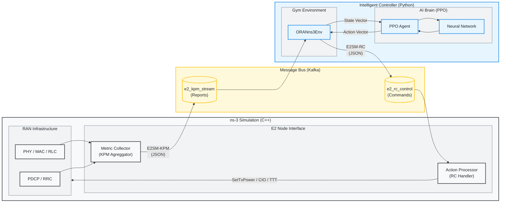

# Radio-Cortex: O-RAN RL Congestion Control

Radio-Cortex is a closed-loop control system that uses Reinforcement Learning (RL) to optimize network parameters (Tx Power, CIO, TTT) in an O-RAN compliant ns-3 simulation. It features a real-time feedback loop where an RL agent (PPO) receives KPM (Key Performance Metrics) from ns-3 via Kafka and sends back RC (RAN Control) actions, with a live Rich TUI dashboard and per-step KPM verification logging.

### 🏆 Key Innovations & Solved Challenges
Radio-Cortex pushes the boundary of O-RAN intelligence by solving three fundamental problems in applying RL to wireless networks:

1.  **Scale-Free "Dragon" Architecture (Bidirectional BDH)**:
    -   *Problem*: Standard Neural Networks require fixed input sizes (breaking when UEs join/leave). Furthermore, standard Transformers use "Causal Masking," which blinds early tokens (Cells) from seeing later tokens (UEs).
    -   *Solution*: We adapted the **Dragon Hatchling (BDH)** architecture into a **Bidirectional Policy**. By removing the causal mask, we allow Base Stations to fully "attend" to all User tokens simultaneously, regardless of their position in the sequence. This creates a truly **Scale-Free Agent** that trains on 5 UEs but successfully controls 100 UEs without retraining.

2.  **Curriculum Reward Engine (Multi-Objective Safety)**:
    -   *Problem*: Network optimization is a zero-sum game (e.g., High Throughput vs. Low Energy). Naive RL agents often "reward hack" or receive persistently negative rewards, causing learning collapse.
     -   *Solution*: We implemented a **3-Level Curriculum Reward Engine** with *Survival Bias* and **gated promotion** (minimum 50 steps per level + 50-step history window). **Level 0 (Bootstrap)**: Throughput + Packet Loss (Survival) + a constant `+1.0` bias. **Level 1 (Quality)**: Adds Delay and Fairness rewards. **Level 2 (Efficiency)**: Adds Energy, Load Balancing, and Handover optimization. This ensures stable, progressive learning.

3.  **Cell-Centric Action Space (6-Dim Causal Control)**:
    -   *Problem*: RL agents often output erratic "bang-bang" control actions. Including non-causal actions (e.g., MAC Delay, CQI Timer) breaks the cause→effect chain PPO relies on.
    -   *Solution*: We compressed the action space to **6 dimensions** (2 per cell: TxPower, HandoverSensitivity). **HandoverSensitivity** is a physics-informed fusion of TTT and Hysteresis into a single parameter: -1=conservative (resists handovers), +1=aggressive (triggers handovers easily). This restores causality and reduces dimensionality by 60% vs. the original 5-action design. Frame stacking (3 frames) provides temporal context.

## 🚀 End-to-End Installation Guide

For a complete, automated setup on Linux:
```bash
# 1. Clone the Repositories
git clone https://github.com/ishreyanshkumar/Radio-Cortex.git
cd Radio-Cortex
 
# 2. Run the End-to-End Setup Script
# This will:
# - Create a virtual environment (.venv)
# - Install dependencies
# - Clone and Build ns-3 (Optimized)
# - Link scenarios
# - Start Kafka
bash scripts/setup.sh
```
 
---
 
### Manual Installation Steps (Alternative)
 
If the script fails or you prefer manual control, follow these steps:
 
### 1. Clone the Repositories
```bash
# Clone the main project
git clone https://github.com/ishreyanshkumar/Radio-Cortex.git
cd Radio-Cortex
 
# Clone ns-allinone (Official Gitlab Repository)
git clone https://gitlab.com/nsnam/ns-3-allinone.git
cd ns-3-allinone
./download.py ns-3.46.1
cd ..
```
 
### 2. Set up Python Virtual Environment
```bash
# Create venv in the parent directory (or project root)
python3 -m venv .venv
 
# Activate the virtual environment
source .venv/bin/activate
 
# Install dependencies
pip install -r requirements.txt
```
 
### 3. Build ns-3 & Link Scenario
ns-3 requires specific libraries (like `librdkafka`) for the O-RAN interface to work.
```bash
# 1. Install librdkafka (system-level)
sudo apt-get install librdkafka-dev
 
# 2. Link the Radio-Cortex scenario into ns-3 scratch (MUST be done before build)
cd ns-3-allinone/ns-3.46.1/scratch
rm -rf *  # CLEANUP: Remove default examples to avoid build conflicts
ln -sf ../../../oran-congestion-scenario.cc .
ln -sf ../../../CMakeLists.txt .  # Link CMakeLists to register the scenario
cd ..

# 3. Configure and Build ns-3
./ns3 configure -d optimized --enable-examples --enable-tests
./ns3 build
```
 
### 4. Running the Training
 
#### A. Bootstrap & Start Kafka
Kafka and Zookeeper must be running for the E2 interface to function. If this is a fresh setup, use the bootstrap script:
```bash
bash scripts/run_kafka_native.sh
```
*Note: This will download Kafka binaries, install `librdkafka-dev`, and start the services.*

For subsequent starts, you can use:
```bash
./scripts/start_kafka.sh
```

#### B. Start Training
```bash
# Ensure venv is active
source .venv/bin/activate
```

#### 1. Turbo-Charged Curriculum Training
1. **Curriculum Training**: `bash scripts/train_curriculum.sh` (8-stage "Grandmaster" suite for High-End Hardware)
2. **Benchmarking**: `python3 scripts/benchmark_power_suite.py` (BDH vs Baseline vs MLP)
3. **Single Scenario**: `python3 radio_cortex_complete.py --mode train --scenario flash_crowd --total-timesteps 200000`
4. **Debug Scale**: `python3 debug_scalability.py` (Verify 5 UE -> 100 UE generalization)
5. **Clean Workspace**: `bash scripts/cleanup.sh`

#### 2. Storage Safety (Automated)
Radio-Cortex is designed for multi-million step training without disk exhaustion.
*   **Log Purge**: The curriculum script automatically deletes `logs/*.log` (potentially 10GB+) between stages.
*   **CSV Archival**: Raw per-step CSVs are purged post-stage to save room (~3GB).
*   **Preserved**: Only final stage models and summary results are kept.

## 🛠️ Utilities

The `scripts/` directory contains multi-language utilities to assist with development:

- **Cleanup**: `bash scripts/cleanup.sh` - Removes logs, residuals, and caches.
- **Curriculum Training**: `bash scripts/train_curriculum.sh` - 8-stage progressive "Lean Power Suite".
- **Benchmark Suite**: `python3 scripts/benchmark_power_suite.py` - Compares architectures across scenarios.
- **Scalability Test**: `python3 debug_scalability.py` - Tests zero-shot generalization to 100 UEs.
- **Log Analyzer (Go)**: `go run scripts/log_analyzer.go`

---

## 🎮 Usage & Workflows

### Advanced Training Configuration
You can customize the training hyperparameters and environment settings via command-line arguments. Radio-Cortex uses organized argument groups to separate core operations from network settings and advanced tuning.

#### 1. Core Operation
| Argument | Default | Description |
|:---|:---|:---|
| `--mode` | `train` | Operation mode: `train` or `eval`. |
| `--scenario` | `flash_crowd` | ns-3 Scenario (12 available). Use `all` for random rotation. |
| `--total-timesteps` | 100000 | Total training or evaluation steps. |
| `--n-envs` | 12 | Number of parallel environments (vectorized). 12-16 recommended for BDH. |
| `--model` | `bdh` | Policy architecture: `bdh` (Transformer), `nn` (MLP), `t1` (Transformer-1), `t2` (Transformer-2). |
| `--model-path` | `models/radiocortex_{model}.pt` | Path to save/load model checkpoint. |
| `--device` | `None` | Compute device (`cpu` or `cuda`). |
| `--config` | `None` | Path to JSON config file to override any argument. |

#### 2. Network & Environment
| Argument | Default | Description |
|:---|:---|:---|
| `--num-ues` | 20 | Number of User Equipments (UEs). |
| `--num-cells` | 3 | Number of cells (eNodeBs). |
| `--sim-time` | 20.0 | Simulation duration per episode (seconds). **(See Speed Tips below)** |
| `--kpm-interval` | 100 | KPM Reporting Interval in ms. |
| `--system-bandwidth-mhz` | 10.0 | System Bandwidth (5.0, 10.0, 20.0). |

---

### ⚡ High-Performance Training Guide

#### How to Train at "Grandmaster" Levels
To achieve maximum accuracy for project displays or research, use the hypertuned curriculum:

1. **Max out Parallelism**: Set `--n-envs 32`.
2. **Batch for Stability**: Set `--batch-size 4096`. 
3. **Deep Learning**: Set `--ppo-epochs 20`. This allows the agent to extract maximum value from every expensive simulation step.

**Recommended "Grandmaster" Suite:**
```bash
./scripts/train_curriculum.sh
```

#### Optimal Hyperparameters (32 envs + BDH)

| Parameter | Default | Optimal (Turbo Suite) | Rationale |
|:---|:---:|:---:|:---|
| `--learning-rate` | 3e-4 | **3e-4** | Standard reliable LR |
| `--batch-size` | 256 | **4096** | Massive batch for deep convergence |
| `--rollout-steps` | 128 | **512** | Large buffer (16k steps) for stable batch |
| `--ppo-epochs` | 10 | **20** | Squeeze max learning from rollouts |
| `--hidden-dim` | 256 | **512** | Capture complex nuances in long suites |
| `--sim-time` | 20.0 | **50.0** | Longer episodes to capture full congestion decay |

> [!TIP]
> All optimal hyperparameters are baked into `scripts/train_curriculum.sh`. Just run it.

#### 3. Advanced RL Tuning
| Argument | Default | Description |
|:---|:---|:---|
| `--learning-rate` | 3e-4 | PPO Learning rate. |
| `--batch-size` | 256 | Batch size for optimization updates. |
| `--rollout-steps` | 128 | Steps per rollout trajectory. |
| `--gamma` | 0.99 | Discount factor. |
| `--hidden-dim` | 256 | Network hidden dimension. |
| `--gae-lambda` | 0.95 | GAE normalization lambda. |
| `--clip-epsilon` | 0.2 | PPO clipping bound. |
| `--vf-coef` | 0.5 | Value function loss weight. |
| `--ent-coef` | 0.01 | Entropy regularization weight. |
| `--max-grad-norm` | 0.5 | Gradient clipping threshold. |
| `--checkpoint-interval` | 5 | Checkpoint frequency (updates). |
| `--log-interval` | 5 | Console log frequency (updates). |

### 🌍 Simulation Scenarios

Radio-Cortex supports 12 diverse scenarios that stress-test different aspects of RAN intelligence.

| Scenario | Type | Description | Key Metric |
| :--- | :--- | :--- | :--- |
| `flash_crowd` | Traffic | Sudden influx of users in one cell. | Congestion Intensity |
| `mobility_storm` | Mobility | High-speed users moving across cells. | HO Success Rate |
| `traffic_burst` | Traffic | Periodic surges in application data. | Peak Burst Loss |
| `handover_ping_pong` | Mobility | Users oscillating between cell boundaries. | HO Count per UE |
| `sleepy_campus` | Energy | Low-traffic night-time vs high-traffic day-time. | Energy Efficiency |
| `ambulance` | QoS | High-priority emergency stream in congested RAN. | Priority UE Delay |
| `adversarial` | Reliability | Rapid fluctuation in signal (shadowing). | Stability Score |
| `commuter_rush` | Scaled Mobility | Mass group handover (50+ UEs moving together). | RACH Failure Rate |
| `mixed_reality` | Slicing | Concurrent VR (Latent) and TCP (Bulk) users. | Slice Isolation |
| `urban_canyon` | PHY | Sudden signal blockage behind buildings. | Recovery Time |
| `iot_tsunami` | Scale | Massive device count (100+ UEs, small packets). | Scheduling Delay |
| `spectrum_crunch` | Resources | Multi-band management (Carrier Aggregation). | Aggregate Throughput |


### 🚀 CLI Training Reference

Train the O-RAN Intelligent Controller using PPO (Proximal Policy Optimization).

# 8-stage "Lean Power Suite" curriculum (Optimized for Speed)
bash scripts/train_curriculum.sh

# Preview the plan without executing
bash scripts/train_curriculum.sh --dry-run
```

#### 2. Single Scenario Training
```bash
# General usage
python3 radio_cortex_complete.py --mode train --scenario <name> --total-timesteps 200000

# Example: Flash Crowd with 50 UEs
python3 radio_cortex_complete.py --mode train --scenario flash_crowd --num-ues 50 --total-timesteps 200000
```

#### 3. Parallel & Performance Training
```bash
# Run 16 parallel simulations on BDH (requires optimized build)
python3 radio_cortex_complete.py --mode train --scenario flash_crowd --model bdh --n-envs 16 \
    --total-timesteps 200000 --learning-rate 1e-4 --batch-size 512 --rollout-steps 256
```

#### 4. Advanced Hyperparameter Tuning
```bash
python3 radio_cortex_complete.py --mode train \
    --learning-rate 0.0001 \
    --gamma 0.995 \
    --batch-size 512 \
    --model-path models/custom_agent.pt
```

---

## 📊 CLI Evaluation & Benchmarking

Benchmarking compares the AI agent against the **Static-RAN** baseline. Results are appended to `results/experiment_results.csv`.

#### 1. Baseline Benchmark (AI disabled)
Run this first to establish a "ground truth" performance floor.
```bash
python3 radio_cortex_complete.py --mode eval --model base --scenario flash_crowd
```

#### 2. AI Agent Evaluation
```bash
# Evaluate the default BDH model on mobility storm
python3 radio_cortex_complete.py --mode eval --model bdh --scenario mobility_storm

# After curriculum training — point to the curriculum checkpoint
python3 radio_cortex_complete.py --mode eval --model bdh --scenario all --n-envs 4 \
    --model-path models/curriculum/stage_13.pt
```

#### 3. Comparing Specific Architectures
```bash
# Compare BDH vs MLP
python3 radio_cortex_complete.py --mode eval --model bdh --scenario flash_crowd
python3 radio_cortex_complete.py --mode eval --model nn --scenario flash_crowd
```

#### 4. Interaction & Results Visualization
View metrics, radar charts, and comparison tables.
```bash
# Standalone HTML
python3 -m http.server 8080
# Open http://localhost:8080/dashboard.html
```


**Metrics Tracked:**
(For detailed formulas and definitions, see [`README_EVAL.md`](README_EVAL.md))
(For the full technical breakdown of the KPM JSON Report structure, see [`KPM_REFERENCE.md`](KPM_REFERENCE.md))

| Category | Metric | Description |
|:---|:---|:---|
| **QoS (User Experience)** | Throughput | Average downlink data rate (Mbps). |
| | End-to-End Delay | Average time for packet delivery (ms). |
| | Jitter | Standard deviation of delay (variability). |
| | Satisfied User Ratio | % of users meeting SLA (Tput > 1Mbps, Delay < 100ms). |
| **Reliability** | Packet Loss Ratio | Ratio of lost packets to total sent. |
| | Handover Success Rate | Ratio of successful vs attempted handovers. |
| **Resource Efficiency** | Spectrum Utilization | Average usage of Resource Blocks (RBs). |
| | Congestion Intensity | % of time network utilization > 90%. |
| | Cell Edge Throughput | 5th percentile user throughput (fairness proxy). |
| | Jain's Fairness | Measure of resource distribution equality (0-1). |
| | Energy Efficiency | System Throughput / Total Power (Mbps/Watt). |
| **PHY / Wireless** | Average SINR | Signal-to-Interference-plus-Noise Ratio (dB). |
| | Average RSRP | Reference Signal Received Power (Signal Strength, dBm). |
| **Mobility** | Handover Count | Number of cell switches per UE. |
| **RIC / E2 Interface** | Control Stability | AI decision consistency score (0-100). |

### 🧠 Curriculum Reward Engine

Radio-Cortex uses a **3-Level Curriculum Reward Engine** that progressively introduces penalties as the agent improves. A **Survival Bias** of `+1.0` ensures rewards are always positive during the bootstrap phase.

#### 📊 Curriculum Levels

| Level | Trigger | Active Components | Reward Range |
|:---|:---|:---|:---|
| **0 (Bootstrap)** | Start | Throughput + SE + Queue + Bias | **+0.5 to +2.0** (positive via bias) |
| **1 (Quality)** | ≥60% UE satisfied + 100 steps | + Delay + **Loss** penalties | ~0.0 to +1.5 |
| **2 (Reliability)** | ≥85% UE satisfied + 100 steps | + Energy + Load penalties | ~-0.5 to +1.0 |

#### 📐 1. UE-Level Utility (User Satisfaction)
Computed per-UE and averaged across the network to ensure fairness.

*   **Throughput ($\alpha$-fairness):** $r_{tput} = W_{tput} \cdot \log(1 + T/T_{max})$
*   **Delay (Two-Tier, Level ≥ 1):** Linear penalty + Quadratic SLA Barrier (both gated by curriculum)
*   **Packet Loss (Level ≥ 1):** $r_{loss} = -W_{loss} \cdot (\exp(\beta \cdot L) - 1)$

#### 🏗️ 2. Cell-Level Utility (Network Efficiency)

*   **Queue Congestion (Level ≥ 0):** Early warning signal from the start.
*   **Energy Efficiency (Level ≥ 2):** Penalizes excessive RB usage.
*   **Load Balancing (Level ≥ 2):** Penalizes high variance in cell loads.

#### ⚖️ 3. Agent Stability + Survival Bias
*   **Action Smoothing:** Penalizes jerky control decisions.
*   **Survival Bias:** Constant `+1.0` added to ensure positive rewards at Level 0.

$$R_{total} = \text{clip}\left( \sum r_{ue} + \sum r_{cell} + r_{smooth} + \text{BIAS}, [-10.0, 5.0] \right)$$

---

### Interpretability
Understand which input features (e.g., Queue Length vs Throughput) drove the agent's decisions.
```bash
python3 interpret_policy.py --checkpoint models/radio_cortex.pt
```

---

## 📂 Codebase Structure & Documentation

### 1. `radio_cortex_complete.py`
**Role:** Main Entry Point & Orchestrator.
This script manages the lifecycle of the training process, initializes the agent, and runs the main loop.

*   **`main()`**: Entry point. Parses arguments (`--mode train/eval/demo`) and routes execution.
*   **`train_radio_cortex(config, ...)`**: The core training loop.
    *   Creates the environment (`create_oran_env`).
    *   Initializes the `PPOTrainer`.
    *   Executes the training steps (rollout collection -> policy update).
    *   Saves the model to `models/radio_cortex.pt`.
*   **`RadioCortexAgent`**: High-level agent class.
    *   `get_rl_action()`: Queries the neural network for an action.
    *   `_heuristic_action()`: Fallback logic rule if RL is disabled.

### 2. `oran_ns3_env.py`
**Role:** Gymnasium Environment Wrapper.
converts ns-3 simulation into a standard OpenAI Gym interface (observation, action, reward).

*   **`ORANns3Env`**: The Gym Environment class.
    *   `step(action)`: Takes an RL action (9 dims = 3 per cell), sends it to ns-3, waits for the next KPM report, and returns (state, reward, done).
    *   `reset()`: Restarts the ns-3 simulation subprocess.
    *   `_compute_reward(e2_msg)`: Delegates to `RewardEngine`.
    *   **`RewardEngine`**: 3-Level Curriculum reward engine with Survival Bias. Combines 8 components (Throughput, Delay, Loss, SE, Energy, Load, Queue, Smoothing) gated by curriculum levels.
    *   **State Space**: `num_cells × 48` (3-frame stacked Enriched Cell Tokens: 16 features/cell × 3 frames). 16 features = 5 native cell metrics + 7 aggregated UE stats + 3 delta features + 1 curriculum level. All strictly normalized to [-1, 1].
    *   **Action Space**: `num_cells × 3` = 9 dimensions — TxPower (differential ±1 dBm), CIO (absolute [-6, 6] dB), and TTT (absolute [0, 1280] ms). All [-1,1]-normalized.
*   **`NS3Interface`**: Handles low-level communication.
    *   `start_simulation()`: Spawns the `./ns3 run ...` subprocess.
    *   `send_rc_control(actions)`: Serializes actions to JSON and sends via Kafka `e2_rc_control` topic.
    *   `receive_kpm_report()`: Polls Kafka `e2_kpm_stream` topic for metrics.

### 3. `rl_training_pipeline.py`
**Role:** Reinforcement Learning Algorithms (PPO).
Implements the PPO algorithm from scratch using PyTorch.

*   **`PPOTrainer`**: Implementation of PPO logic.
    *   `collect_rollout()`: Interacts with the env to gather a batch of experiences.
    *   `compute_gae()`: Calculates Generalized Advantage Estimation for stable learning.
    *   `update_policy()`: Performs the Gradient Descent update steps on the Actor and Critic networks.

### 4. Policy Architectures Supported:
All policies use **state-dependent exploration** (learned log-std heads) for adaptive exploration.

*   **BDH** (Default): Baby Dragon Hatchling (Scale-Free Transformer) — Cell tokenization (12 features per cell), bidirectional self-attention across cells
*   **GPT-2** (`gpt2`): Standard Decoder-Only Transformer — Causal attention over time
*   **Transformer-XL** (`trxl`): Segment-Level Recurrence
*   **Linear Transformer** (`linear`): O(T) Kernel Attention (Katharopoulos)
*   **Universal Transformer** (`universal`): Weight Sharing
*   **Reformer** (`reformer`): Bucketed Attention
*   **MLP** (`nn`): Simple Feed-Forward Baseline

### 5. `interpret_policy.py`
**Role:** Model Interpretability.
Computes saliency maps (gradient * input) to understand which state features (e.g., UE throughput, Cell queue) influence the agent's decisions the most.

*   `_saliency()`: Backpropagates from the action mean to the input state.
*   usage: `python interpret_policy.py --checkpoint models/radio_cortex.pt`

### 6. `scripts/train_quick.sh`
**Role:** Fast Verification.
Runs `radio_cortex_complete.py` with minimal steps (100 timesteps) to verify the pipeline implementation quickly.

### 7. `oran-congestion-scenario.cc`
**Role:** ns-3 Simulation Scenario (C++).
The "Digital Twin" of the RAN. Implements the LTE/5G network, traffic generation, and E2 interface.

*   **`E2InterfaceManager`**: Manages the Kafka bridge.
    *   `SetupKafka()`: Configures `librdkafka` producer/consumer.
    *   `SendKpmReport()`: Collects metrics from all UEs, formats as JSON, and produces to Kafka.
    *   `ProcessRcCommand()`: Parses JSON control messages and applies changes (e.g., `SetTxPower`) to eNodeBs.
*   **`MetricCollector`**: Aggregates simulation traces.
    *   `ReportDlScheduling()`: Callback for DL MAC activity (estimates RB usage).
    *   `ReportAppRx()`: Callback for packet reception (calculates Delay).
    *   `GetAndResetUeMetrics()`: Returns accumulated stats and resets counters.

---

## 🔄 System Architecture



---

### 🖥️ Convergence Dashboard (Rich UI)

Radio-Cortex features a high-fidelity convergence dashboard that replaces standard text logs with mission-critical training metrics.

#### Key Metrics to Observe:
- **Reward**: The primary optimization goal. Should show an **Upward Trend (↗)** over the first 50-100 updates.
- **Explained Variance (Expl Var)**: Measures the Accuracy of the RIC's internal reward predictions.
    - **Value range**: `1.0` (Perfect), `0.0` (Guessing Mean), `< 0.0` (Still exploring/Worse than mean).
    - **Coloring**: `Green` (>0.8) indicates a "Converged" critic; `Red` (<0.4 or negative) is normal for the first ~50 updates.
- **Entropy**: Measures the agent's confidence. Should gradually decrease as the agent becomes more specialized at handling specific congestion scenarios.
- **Activity Heartbeat**: A pulsing `●` / `○` light showing real-time data influx from ns-3.
- **Live Environment Metrics**: Per-environment throughput, delay, loss, SINR, queue, RB utilization, and power — updated at 10Hz.

---

### 📋 Logs & KPM Verification

All debug and verification logs are stored in the `logs/` directory:

| File Pattern | Description |
|:---|:---|
| `logs/ns3_out_X.log` | ns-3 stdout for environment X |
| `logs/ns3_err_X.log` | ns-3 stderr for environment X |
| `logs/kpm_verification_X.jsonl` | KPM verification audit trail for environment X |
| `logs/action_logs.jsonl` | Per-step actions, rewards, and full metrics |

**KPM Verification** logs every received KPM report with:
- `is_real: true/false` — whether data came from ns-3 or a fallback
- `sample_ues` — throughput, SINR, RSRP, delay, loss for first 3 UEs
- `sample_cells` — RB utilization, queue, power, connected UEs
- `reason` — error message when `is_real: false` (fallback)

Use this to verify that all training data is authentic:
```bash
# Check if any fallback data was used during training
grep '"is_real": false' logs/kpm_verification_*.jsonl | wc -l

# View sample real KPM data
head -3 logs/kpm_verification_0.jsonl | python3 -m json.tool
```

---

## 📈 Training Dashboard Guide

| Metric | Target Trend | What it means |
|:---|:---:|:---|
| **Reward** | ↗ Growing | The agent is successfully reducing congestion and improving user QoS. |
| **Trend** | ↗ (Green) | Recent updates have improved performance by 5% or more. |
| **Expl Var** | → 0.9 | High values mean the agent correctly predicts the "cost" of its actions. |
| **Entropy** | ↘ Decreasing | The agent is narrowing down its optimal control strategy (good). |
| **Policy Loss** | ⇄ Oscillating | Normal in PPO; indicates the agent is exploring different tradeoffs. |

> [!TIP]
> **When to Stop?** Stop training when **Explained Variance > 0.8** and the **Reward Trend** stabilizes (→) for 10 consecutive updates. This indicates a "Converged" model.

---

## 📊 Monitoring & Analysis

### 1. View Training & Evaluation Dashboard
The primary way to analyze results is via the interactive HTML dashboard.

```bash
# Start a simple HTTP server
python3 -m http.server 8080

# Open in Browser
# http://localhost:8080/dashboard.html
```

The dashboard automatically loads `results/experiment_results.csv` and provides:
- **Comparison Table**: Sort and filter runs.
- **Radar Charts**: Visual health profile of the network (QoS, Reliability, etc.).
- **Bar Charts**: Side-by-side metric comparison.

### 2. Quick CLI Summary
Quickly check the average metrics from the logs:
```bash
python3 -c "import json; import numpy as np; 
data = [json.loads(l) for l in open('logs/action_logs.jsonl')]; 
print(f'Mean Reward: {np.mean([d[\"reward\"] for d in data]):.4f}')"
```

---

## 🔬 Advanced Workflows

### Scenario Curriculum (8-Stage "Grandmaster" Suite)
The curriculum script trains on progressively harder scenarios with automated inter-stage storage cleanup.

```bash
# Run the full 8-stage "Grandmaster" curriculum
bash scripts/train_curriculum.sh
```

| Stage | Focus | Timesteps | updates | Skill Description |
|:---:|:---|:---:|:---:|:---|
| 1 | Flash Crowd | 800k | ~50 | Basic load balancing (Bootstrap) |
| 2 | Sleepy Campus | 1.5M | ~90 | Energy efficiency (Green RAN) |
| 3 | Urban Canyon | 2.0M | ~120 | Signal recovery & Robustness |
| 4 | Mobility Storm | 2.5M | ~150 | Handover Optimization |
| 5 | Traffic Burst | 3.0M | ~180 | Congestion Management |
| 6 | Ambulance | 3.0M | ~180 | QoS Priority & Slicing |
| 7 | Spectrum Crunch | 3.0M | ~180 | Spectral Efficiency |
| 8 | Generalization Mix | 4.0M | ~240 | Multi-goal Mastery |

**Total: ~14.7M timesteps** (approx 3-4 hours on hi-end hardware) to full multi-domain mastery.

### Network Size Curriculum (Manual)
```bash
# Stage 1: Small Network (5 UEs)
python3 radio_cortex_complete.py --mode train --num-ues 5 --num-cells 2 --total-timesteps 50000 --model-path models/stage1.pt

# Stage 2: Medium Network (20 UEs)
python3 radio_cortex_complete.py --mode train --num-ues 20 --num-cells 3 --total-timesteps 100000 --model-path models/stage2.pt

# Stage 3: Large Network (40 UEs)
python3 radio_cortex_complete.py --mode train --num-ues 40 --num-cells 5 --total-timesteps 200000 --model-path models/stage3.pt
```

### Batch Experiments (Bash Loop)
Run multiple experiments with different learning rates.
```bash
for lr in 0.0001 0.0003 0.001; do
    echo "Training with LR=$lr"
    python3 radio_cortex_complete.py --mode train --learning-rate $lr --model-path models/lr_${lr}.pt
done
```

