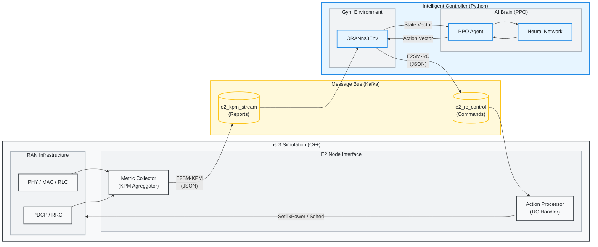

# Radio-Cortex: O-RAN RL Congestion Control

Radio-Cortex is a closed-loop control system that uses Reinforcement Learning (RL) to optimize network parameters (Tx Power, Schedulers) in an O-RAN compliant ns-3 simulation. It demonstrates a real-time feedback loop where an RL agent (PPO) receives KPM (Key Performance Metrics) from ns-3 via Kafka and sends back RC (RAN Control) actions.

## 🚀 Quick Start

### 1. Prerequisites
- Linux OS
- Python 3.10+
- ns-3 (v3.46.1) with dependent modules
- Apache Kafka (v3.6.1)

### 2. Installation
```bash
# 1. Install Python dependencies
pip install numpy torch gymnasium kafka-python

# 2. Build ns-3
cd ns-allinone-3.46.1/ns-3.46.1
./ns3 build
cd ../..

# 3. Link Simulation Scenario
cd ns-allinone-3.46.1/ns-3.46.1/scratch
ln -sf ../../../oran-congestion-scenario.cc .
cd ../../..
```

### 3. Running the Training
The training pipeline is managed by `radio_cortex_complete.py`. It requires Kafka to be running.

```bash
# 1. Start Kafka (in a separate terminal or background)
./start_kafka.sh

# 2. Run Training (Standard)
python3 radio_cortex_complete.py --mode train
```

This commands automatically:
1.  Launches the ns-3 simulation subprocess.
2.  Connects to the Kafka E2 interface.
3.  Trains the PPO agent.
4.  Saves models to `models/`.

---

## 🎮 Usage & Workflows

### Advanced Training Configuration
You can customize the training hyperparameters and environment settings via command-line arguments.

| Argument | Default | Description |
|:---|:---|:---|
| `--mode` | `train` | Operation mode: `train`, `eval`, `demo`. |
| `--num-ues` | 20 | Number of User Equipments (UEs). |
| `--num-cells` | 3 | Number of cells (eNodeBs). |
| `--scenario` | `flash_crowd` | ns-3 Scenario (12 available). |
| `--sim-time` | 10.0 | Simulation duration per episode (seconds). |
| `--kpm-interval` | 100 | KPM Reporting Interval in ms. |
| `--system-bandwidth-mhz` | 10.0 | System Bandwidth (5.0, 10.0, 20.0). |
| `--total-timesteps` | 10000 | Total training timesteps. |
| `--learning-rate` | 3e-4 | Learning rate for PPO. |
| `--batch-size` | 64 | Batch size for optimization. |
| `--gamma` | 0.99 | Discount factor. |
| `--model-path` | `models/radio_cortex.pt` | Path to save/load model. |
| `--config` | None | Path to JSON config file to override args. |
| `--device` | `cpu/cuda` | Compute device. |
| `--hidden-dim` | 256 | Hidden dimension for actor/critic networks. |

### 🌍 Simulation Scenarios

Radio-Cortex supports 12 diverse scenarios that stress-test different aspects of RAN intelligence.

| Scenario | Type | Description | Key Metric |
| :--- | :--- | :--- | :--- |
| `flash_crowd` | Traffic | Sudden influx of users in one cell. | Congestion Intensity |
| `mobility_storm` | Mobility | High-speed users moving across cells. | HO Success Rate |
| `traffic_burst` | Traffic | Periodic surges in application data. | Peak Burst Loss |
| `handover_ping_pong` | Mobility | Users oscillating between cell boundaries. | HO Count per UE |
| `sleepy_campus` | Energy | Low-traffic night-time vs high-traffic day-time. | Energy Efficiency |
| `ambulance` | QoS | High-priority emergency stream in congested RAN. | Priority UE Delay |
| `adversarial` | Reliability | Rapid fluctuation in signal (shadowing). | Stability Score |
| `commuter_rush` | Scaled Mobility | Mass group handover (50+ UEs moving together). | RACH Failure Rate |
| `mixed_reality` | Slicing | Concurrent VR (Latent) and TCP (Bulk) users. | Slice Isolation |
| `urban_canyon` | PHY | Sudden signal blockage behind buildings. | Recovery Time |
| `iot_tsunami` | Scale | Massive device count (100+ UEs, small packets). | Scheduling Delay |
| `spectrum_crunch` | Resources | Multi-band management (Carrier Aggregation). | Spectral Efficiency |


**Example: Run a custom scenario**
```bash
python3 radio_cortex_complete.py --mode train --scenario iot_tsunami --num-ues 50
```

**Example: Run full benchmark suite**
```bash
python3 radio_cortex_complete.py --mode eval
```

### 🔍 Verification & Testing
Before running a long training session, verify that the data pipeline is working.

- **E2 Interface Check:** Confirm real KPM metrics (throughput, delay) are flowing from ns-3 via Kafka.
  ```bash
  python3 verify_kpm_data.py
  ```
- **RL Pipeline Check:** Train a tiny agent on a mock environment (no ns-3 needed) to verify the neural network and PPO logic.
  ```bash
  python3 quick_train.py
  ```

### 📊 Evaluation
Evaluate a trained model against a static baseline (no AI control).
```bash
python3 radio_cortex_complete.py --mode train --num-ues 50 --num-cells 10 --scenario mobility_storm
```

**Hyperparameter Tuning:**
```bash
python3 radio_cortex_complete.py --mode train --learning-rate 0.0001 --gamma 0.995 --batch-size 128
```

**Using a Config File:**
```bash
python3 radio_cortex_complete.py --mode train --config experiments/exp1_config.json
```

### Evaluation
Evaluate a trained model against a static baseline (no AI control).
```bash
python3 radio_cortex_complete.py --mode eval --model-path models/radio_cortex.pt
```

**Outputs (saved in `results/`):**
- **Comparison Plots (`*_comparison.png`):** Detailed bar charts comparing all KPIs (TP, Delay, Loss, SINR, etc.) for both AI and Baseline.
- **Health Radar (`*_radar.png`):** High-level view across 6 composite scores (QoS, Reliability, Resources, Buffer, PHY, RIC).
- **Metric Reports (`*_metrics.csv`, `*_metrics.tex`):** Raw data and ready-to-use LaTeX tables for reports.

**Metrics Tracked:**

| Category | Metric | Description |
|:---|:---|:---|
| **Core QoS** | Throughput | Average downlink throughput (Mbps) |
| | Packet Loss | Ratio of lost packets |
| | Delay | Average end-to-end latency (ms) |
| | SINR | Average Signal-to-Interference-plus-Noise Ratio (dB) |
| **Capacity** | Satisfied Users | % of UEs meeting SLA (Tput > 1Mbps, Delay < 100ms) |
| | Congestion Intensity | % of time RB utilization > 90% |
| | Congestion Intensity | % of time RB utilization > 90% |
| **Network** | Handover Success Rate | Successful / Attempted handovers |
| **RIC Performance** | E2 Loop Latency | Time from KPM reception to Control transmission (ms) |
| | Message Overhead | E2 messages per second (Hz) |

### Quick Logic Verification
To test the RL pipeline without the overhead of the full ns-3 simulation (no Kafka required):
```bash
python3 quick_train.py
```

### Interpretability
Understand which input features (e.g., Queue Length vs Throughput) drove the agent's decisions.
```bash
python3 interpret_policy.py --checkpoint models/radio_cortex.pt
```

---

## 📂 Codebase Structure & Documentation

### 1. `radio_cortex_complete.py`
**Role:** Main Entry Point & Orchestrator.
This script manages the lifecycle of the training process, initializes the agent, and runs the main loop.

*   **`main()`**: Entry point. Parses arguments (`--mode train/eval/demo`) and routes execution.
*   **`train_radio_cortex(config, ...)`**: The core training loop.
    *   Creates the environment (`create_oran_env`).
    *   Initializes the `PPOTrainer`.
    *   Executes the training steps (rollout collection -> policy update).
    *   Saves the model to `models/radio_cortex.pt`.
*   **`RadioCortexAgent`**: High-level agent class.
    *   `get_rl_action()`: Queries the neural network for an action.
    *   `_heuristic_action()`: Fallback logic rule if RL is disabled.

### 2. `oran_ns3_env.py`
**Role:** Gymnasium Environment Wrapper.
converts ns-3 simulation into a standard OpenAI Gym interface (observation, action, reward).

*   **`ORANns3Env`**: The Gym Environment class.
    *   `step(action)`: Takes an RL action, sends it to ns-3, waits for the next KPM report, and returns (state, reward, done).
    *   `reset()`: Restarts the ns-3 simulation subprocess.
    *   `_compute_reward(e2_msg)`: Calculates reward based on Throughput (Log utility), Delay, and Fairness.
*   **`NS3Interface`**: Handles low-level communication.
    *   `start_simulation()`: Spawns the `./ns3 run ...` subprocess.
    *   `send_rc_control(actions)`: Serializes actions to JSON and sends via Kafka `e2_rc_control` topic.
    *   `receive_kpm_report()`: Polls Kafka `e2_kpm_stream` topic for metrics.

### 3. `rl_training_pipeline.py`
**Role:** Reinforcement Learning Algorithms (PPO).
Implements the PPO algorithm from scratch using PyTorch.

*   **`PPOTrainer`**: Implementation of PPO logic.
    *   `collect_rollout()`: Interacts with the env to gather a batch of experiences.
    *   `compute_gae()`: Calculates Generalized Advantage Estimation for stable learning.
    *   `update_policy()`: Performs the Gradient Descent update steps on the Actor and Critic networks.

### 4. `neural_networks.py`
**Role:** Neural Network Architectures.
Contains the PyTorch definitions for the RL agents.

*   **`ActorCritic`**: The default PPO network.
    *   `Actor`: Maps state -> action (Gaussian distribution).
    *   `Critic`: Maps state -> value estimate.

### 5. `interpret_policy.py`
**Role:** Model Interpretability.
Computes saliency maps (gradient * input) to understand which state features (e.g., UE throughput, Cell queue) influence the agent's decisions the most.

*   `_saliency()`: Backpropagates from the action mean to the input state.
*   usage: `python interpret_policy.py --checkpoint models/radio_cortex.pt`

### 6. `quick_train.py`
**Role:** Fast Verification (Mock).
Trains a tiny PPO agent on a mock environment (no ns-3, no Kafka) to verify the RL pipeline implementation quickly (seconds vs hours).

### 7. `oran-congestion-scenario.cc`
**Role:** ns-3 Simulation Scenario (C++).
The "Digital Twin" of the RAN. Implements the LTE/5G network, traffic generation, and E2 interface.

*   **`E2InterfaceManager`**: Manages the Kafka bridge.
    *   `SetupKafka()`: Configures `librdkafka` producer/consumer.
    *   `SendKpmReport()`: Collects metrics from all UEs, formats as JSON, and produces to Kafka.
    *   `ProcessRcCommand()`: Parses JSON control messages and applies changes (e.g., `SetTxPower`) to eNodeBs.
*   **`MetricCollector`**: Aggregates simulation traces.
    *   `ReportDlScheduling()`: Callback for DL MAC activity (estimates RB usage).
    *   `ReportAppRx()`: Callback for packet reception (calculates Delay).
    *   `GetAndResetUeMetrics()`: Returns accumulated stats and resets counters.

---

## 🔄 System Architecture



---

## 🐛 Troubleshooting

### "Failed to connect to Kafka"
-   Ensure you ran `./start_kafka.sh`.
-   Check logs: `cat kafka.log` or `cat zookeeper.log`.
-   Verify ports: `netstat -tuln | grep 9092`

### "No KPM data received"
-   Wait a few seconds for ns-3 to initialize.
-   Check `ns3.log` (created in project root) to see if the simulation crashed.
-   Ensure `oran-congestion-scenario` compiled successfully.

### Monitoring
Watch training progress in real-time:
```bash
tail -f action_logs.jsonl
```

---

## 📊 Monitoring & Analysis

### 1. Plot Training Metrics
You can plot the training progress (rewards, throughput) using this Python script. It reads from `action_logs.jsonl`.
```python
import json
import matplotlib.pyplot as plt

with open('action_logs.jsonl') as f:
    # Read line by line
    data = [json.loads(line) for line in f]

rewards = [d['reward'] for d in data]
steps = [d['step'] for d in data]

plt.figure(figsize=(10, 5))
plt.plot(steps, rewards)
plt.xlabel('Steps')
plt.ylabel('Reward')
plt.title('Training Progress')
plt.savefig('training_plot.png')
print("Saved training_plot.png")
```

### 2. View Summary Stats
Quickly check the average metrics from the logs:
```bash
python3 -c "import json; import numpy as np; 
data = [json.loads(l) for l in open('action_logs.jsonl')]; 
print(f'Mean Reward: {np.mean([d[\"reward\"] for d in data]):.4f}')"
```

---

## 🔬 Advanced Workflows

### Curriculum Learning Loop
Train on progressively harder scenarios (Small -> Medium -> Large network).

```bash
# Stage 1: Small Network
python3 radio_cortex_complete.py --mode train --num-ues 5 --num-cells 2 --total-timesteps 5000 --model-path models/stage1.pt

# Stage 2: Medium Network (Load Stage 1 model?? - currently training from scratch)
# To implement true curriculum, you'd load the previous model.
python3 radio_cortex_complete.py --mode train --num-ues 20 --num-cells 3 --total-timesteps 10000 --model-path models/stage2.pt

# Stage 3: Large Network
python3 radio_cortex_complete.py --mode train --num-ues 40 --num-cells 5 --total-timesteps 20000 --model-path models/stage3.pt
```

### Batch Experiments (Bash Loop)
Run multiple experiments with different learning rates.
```bash
for lr in 0.0001 0.0003 0.001; do
    echo "Training with LR=$lr"
    python3 radio_cortex_complete.py --mode train --learning-rate $lr --model-path models/lr_${lr}.pt
done
```

