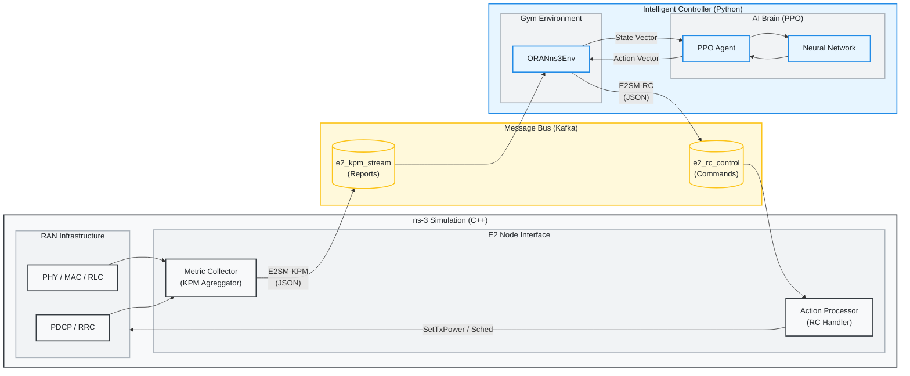

# Radio-Cortex: O-RAN RL Congestion Control

Radio-Cortex is a closed-loop control system that uses Reinforcement Learning (RL) to optimize network parameters (Tx Power, Schedulers) in an O-RAN compliant ns-3 simulation. It demonstrates a real-time feedback loop where an RL agent (PPO) receives KPM (Key Performance Metrics) from ns-3 via Kafka and sends back RC (RAN Control) actions.


## 🚀 End-to-End Installation Guide

Follow these steps to set up the environment from scratch.

### 1. Clone the Repositories
```bash
# Clone the main project
git clone https://github.com/ishreyanshkumar/Radio-Cortex.git
cd Radio-Cortex

# Clone ns-allinone (Official Gitlab Repository)
git clone https://gitlab.com/nsnam/ns-3-allinone.git
cd ns-3-allinone
./download.py -n ns-3.46.1
cd ..
```

### 2. Set up Python Virtual Environment
```bash
# Create venv in the parent directory (or project root)
python3 -m venv .venv

# Activate the virtual environment
source .venv/bin/activate

# Install dependencies
pip install -r requirements.txt
```

### 3. Build ns-3 & Link Scenario
ns-3 requires specific libraries (like `librdkafka`) for the O-RAN interface to work.
```bash
# 1. Install librdkafka (system-level)
sudo apt-get install librdkafka-dev

# 2. Build ns-3
cd ns-3-allinone/ns-3.46.1

./ns3 configure -d optimized --enable-examples --enable-tests
./ns3 build

# 3. Link the Radio-Cortex scenario into ns-3 scratch
cd scratch
ln -sf ../../../oran-congestion-scenario.cc .
cd ../../..
```

### 4. Running the Training

#### A. Bootstrap & Start Kafka
Kafka and Zookeeper must be running for the E2 interface to function. If this is a fresh setup, use the bootstrap script:
```bash
bash run_kafka_native.sh
```
*Note: This will download Kafka binaries, install `librdkafka-dev`, and start the services.*

For subsequent starts, you can use:
```bash
./start_kafka.sh
```

#### B. Start Training
```bash
# Ensure venv is active
source .venv/bin/activate

### Quick Start
1. **Train Model**: `python3 radio_cortex_complete.py --mode train --scenario all`
2. **Clean Workspace**: `bash scripts/cleanup.sh`

# Run Training (Fast Parallel Mode)
python3 radio_cortex_complete.py --mode train --scenario all --n-envs 4 --total-timesteps 50000
```

## 🛠️ Utilities

The `scripts/` directory contains multi-language utilities to assist with development:

- **Cleanup**: `bash scripts/cleanup.sh` - Removes logs, residuals, and caches.
- **Log Analyzer (Go)**: `go run scripts/log_analyzer.go`

---

## 🎮 Usage & Workflows

### Advanced Training Configuration
You can customize the training hyperparameters and environment settings via command-line arguments.

| Argument | Default | Description |
|:---|:---|:---|
| `--mode` | `train` | Operation mode: `train`, `eval`, `demo`. |
| `--num-ues` | 20 | Number of User Equipments (UEs). |
| `--num-cells` | 3 | Number of cells (eNodeBs). |
| `--scenario` | `flash_crowd` | ns-3 Scenario (12 available). |
| `--sim-time` | 300.0 | Simulation duration per episode (seconds). |
| `--kpm-interval` | 100 | KPM Reporting Interval in ms. |
| `--system-bandwidth-mhz` | 10.0 | System Bandwidth (5.0, 10.0, 20.0). |
| `--total-timesteps` | 100000 | Total training timesteps. |
| `--learning-rate` | 3e-4 | Learning rate for PPO. |
| `--batch-size` | 256 | Batch size for optimization. |
| `--gamma` | 0.99 | Discount factor. |
| `--model-path` | `models/radio_cortex.pt` | Path to save/load model. |
| `--config` | None | Path to JSON config file to override args. |
| `--device` | `cpu/cuda` | Compute device. |
| `--hidden-dim` | 256 | Hidden dimension for actor/critic networks. |
| `--n-envs` | 4 | Number of parallel implementations to run for training/eval. |

### 🌍 Simulation Scenarios

Radio-Cortex supports 12 diverse scenarios that stress-test different aspects of RAN intelligence.

| Scenario | Type | Description | Key Metric |
| :--- | :--- | :--- | :--- |
| `flash_crowd` | Traffic | Sudden influx of users in one cell. | Congestion Intensity |
| `mobility_storm` | Mobility | High-speed users moving across cells. | HO Success Rate |
| `traffic_burst` | Traffic | Periodic surges in application data. | Peak Burst Loss |
| `handover_ping_pong` | Mobility | Users oscillating between cell boundaries. | HO Count per UE |
| `sleepy_campus` | Energy | Low-traffic night-time vs high-traffic day-time. | Energy Efficiency |
| `ambulance` | QoS | High-priority emergency stream in congested RAN. | Priority UE Delay |
| `adversarial` | Reliability | Rapid fluctuation in signal (shadowing). | Stability Score |
| `commuter_rush` | Scaled Mobility | Mass group handover (50+ UEs moving together). | RACH Failure Rate |
| `mixed_reality` | Slicing | Concurrent VR (Latent) and TCP (Bulk) users. | Slice Isolation |
| `urban_canyon` | PHY | Sudden signal blockage behind buildings. | Recovery Time |
| `iot_tsunami` | Scale | Massive device count (100+ UEs, small packets). | Scheduling Delay |
| `spectrum_crunch` | Resources | Multi-band management (Carrier Aggregation). | Spectral Efficiency |


**Example: Run a custom scenario**
```bash
python3 radio_cortex_complete.py --mode train --scenario iot_tsunami --num-ues 50
```

**Example: Run full benchmark suite**
```bash
python3 radio_cortex_complete.py --mode eval
```

### 🎲 Multi-Scenario Training (Domain Randomization)

Train a single robust model that cycles through **all 12 scenarios** automatically. Each episode randomly selects a different scenario, teaching the agent to generalize.

```bash
python3 radio_cortex_complete.py --mode train --scenario all --total-timesteps 50000
```

#### Why It Works
The `RewardEngine` is **scenario-agnostic** — it only reads metrics (throughput, delay, loss, SINR, queue, load), not the scenario name. All 12 scenarios output the same KPM metrics, so the reward function works universally.

#### Pros & Cons

| ✅ Pros | ❌ Cons |
|:---|:---|
| **Generalization** — One model handles any condition | **Longer Training** — 3-5x more timesteps needed |
| **Robustness** — Won't fail on unseen scenarios | **Jack of All Trades** — May not be "best" on any single scenario |
| **Competition Advantage** — "Universal agent" is impressive | **Harder to Debug** — Issues harder to trace to specific scenario |
| **No Wasted Data** — Every scenario contributes | **Reward Variance** — Different scenarios may have different reward scales |

#### Mitigations

| Issue | Solution |
|:---|:---|
| Long training time | Increase `--total-timesteps` to 50,000-100,000 |
| Scenario bias | Already mitigated — reward is normalized and clipped per-component |
| Debugging | Check `action_logs.jsonl` to trace which scenario produced bad rewards |
| Reward variance | Clipping bounds ([-10, +2]) prevent any scenario from dominating |


### 🔍 Verification & Testing
Before running a long training session, verify that the data pipeline is working.

- **E2 Interface Check:** Confirm real KPM metrics (throughput, delay) are flowing from ns-3 via Kafka.
  ```bash
  python3 verify_kpm_data.py
  ```
- **RL Pipeline Check:** Train a tiny agent on a mock environment (no ns-3 needed) to verify the neural network and PPO logic.
  ```bash
  python3 quick_train.py
  ```

### 🏋️ Training Variations
Train on specific scenarios or customize hyperparameters.
```bash
python3 radio_cortex_complete.py --mode train --num-ues 50 --num-cells 10 --scenario mobility_storm
```

**Hyperparameter Tuning:**
```bash
python3 radio_cortex_complete.py --mode train --learning-rate 0.0001 --gamma 0.995 --batch-size 128
```

**Using a Config File:**
```bash
python3 radio_cortex_complete.py --mode train --config experiments/exp1_config.json
```

#### ⚡ Performance Tuning (Recommended)

To significantly speed up training (from >50s/step to <0.3s/step):

1. **Compile Optimized Build** (Critical for parallel mode):
   ```bash
   cd ns-allinone-3.46.1/ns-3.46.1
   ./ns3 configure -d optimized --enable-examples --enable-tests --disable-python
   ./ns3 build -j$(nproc)
   ```
   *Radio-Cortex will automatically detect and prioritize this binary.*

2. **Run in Parallel**:
   Use `--n-envs 4` (or more, depending on CPU cores) to train multiple simulations simultaneously.
   ```bash
   python radio_cortex_complete.py --mode train --scenario all --n-envs 4
   ```

3. **Persistent Simulation**:
   The environment automatically keeps Kafka connections alive across episodes to prevent rebalancing delays.

---

## 📊 Evaluation & Benchmarking
Evaluate a trained model against a static baseline (no AI control).

```bash
# Run full evaluation suite (all 12 scenarios) in parallel (Recommended)
python3 radio_cortex_complete.py --mode eval --n-envs 4

# Sequential Evaluation (slower)
python3 radio_cortex_complete.py --mode eval --n-envs 1
```

**Outputs (saved in `results/`):**
- **Comparison Plots (`*_comparison.png`):** Detailed bar charts comparing all KPIs (TP, Delay, Loss, SINR, etc.) for both AI and Baseline.
- **Health Radar (`*_radar.png`):** High-level view across 6 composite scores (QoS, Reliability, Resources, Buffer, PHY, RIC).
- **Metric Reports (`*_metrics.csv`, `*_metrics.tex`):** Raw data and ready-to-use LaTeX tables for reports.

**Metrics Tracked:**
(For detailed formulas and definitions, see [`README_EVAL.md`](README_EVAL.md))
(For the full technical breakdown of the KPM JSON Report structure, see [`KPM_REFERENCE.md`](KPM_REFERENCE.md))

| Category | Metric | Description |
|:---|:---|:---|
| **QoS (User Experience)** | Throughput | Average downlink data rate (Mbps). |
| | End-to-End Delay | Average time for packet delivery (ms). |
| | Jitter | Standard deviation of delay (variability). |
| | Satisfied User Ratio | % of users meeting SLA (Tput > 1Mbps, Delay < 100ms). |
| **Reliability** | Packet Loss Ratio | Ratio of lost packets to total sent. |
| | Peak Burst Loss | Max loss in any 1s window (instability indicator). |
| | Recovery Time | Time to return to <2% loss after failure. |
| | Handover Success Rate | Ratio of successful vs attempted handovers. |
| **Resource Efficiency** | Spectrum Utilization | Average usage of Resource Blocks (RBs). |
| | Congestion Intensity | % of time network utilization > 90%. |
| | Cell Edge Throughput | 5th percentile user throughput (fairness proxy). |
| | Jain's Fairness | Measure of resource distribution equality (0-1). |
| | Spectral Efficiency | System Throughput / Bandwidth (bits/sec/Hz). |
| | Energy Efficiency | System Throughput / Total Power (Mbps/Watt). |
| **PHY / Wireless** | Average SINR | Signal-to-Interference-plus-Noise Ratio (dB). |
| | Average RSRP | Reference Signal Received Power (Signal Strength, dBm). |
| **Mobility** | Handover Count | Number of cell switches per UE. |
| **RIC / E2 Interface** | E2 Loop Latency | Control loop response time (ms). |
| | RIC Message Overhead | E2 messages per second. |
| | Control Stability | AI decision consistency score (0-100). |

### 🧠 Hybrid Reward Engine

Radio-Cortex uses a multi-objective **"Hybrid Reward Engine"** that balances individual user experience with global network efficiency. The engine uses a **Two-Stage Safety Clipping** mechanism to prevent any single metric from dominating the gradients:

#### � 1. UE-Level Utility (User Satisfaction)
Computed per-UE and averaged across the network to ensure fairness. Uses E2SM-KPM `ue_metrics`.

*   **Throughput ($\alpha$-fairness):** $r_{tput} = \text{clip}\left( W_{tput} \cdot \log(1 + \frac{T}{T_{max}}), [-0.5, 5.0] \right)$
    Logarithmic utility ensures the agent prioritizes users with low throughput over those already well-served.
*   **Delay (Two-Tier):** $r_{delay} = \text{clip}\left( -\left( W_{d1} \cdot \frac{D}{D_{max}} + W_{d2} \cdot \frac{\max(0, D - D_{sla})^2}{D_{max}^2} \right), [-5.0, 0.0] \right)$
    Combines linear penalty for general delay and a **Quadratic SLA Barrier** that penalizes exponentially if delay exceeds 50ms.
*   **Packet Loss (IQX Model):** $r_{loss} = \text{clip}\left( -W_{loss} \cdot (\exp(\beta \cdot L) - 1), [-5.0, 0.0] \right)$
    Penalizes loss exponentially, capturing the non-linear impact of packet drops on QoE using the Independent Quality X (IQX) model.
*   **Spectral Efficiency:** $r_{se} = \text{clip}\left( W_{se} \cdot \log_2(1 + SINR), [0.0, 2.0] \right)$
    Uses Shannon Capacity to provide a "keep-alive" signal, rewarding good channel quality even during silent periods.

#### 🏗️ 2. Cell-Level Utility (Network Efficiency)
Computed per-cell to optimize infrastructure scaling. Uses E2SM-KPM `cell_metrics`.

*   **Energy Efficiency:** $r_{energy} = \text{clip}\left( -W_{energy} \cdot \frac{RB_{used}}{RB_{max}}, [-2.0, 0.0] \right)$
    Penalizes excessive Resource Block (RB) usage to encourage power-efficient scheduling.
*   **Load Balancing:** $r_{load} = \text{clip}\left( -W_{load} \cdot \sigma(Loads), [-2.0, 0.0] \right)$
    Penalizes high standard deviation in cell loads, driving the agent to distribute users across base stations.
*   **Queue Congestion:** $r_{queue} = \text{clip}\left( -W_{queue} \cdot \frac{Q}{Q_{max}}, [-2.0, 0.0] \right)$
    Penalizes growing buffers as an "early warning" signal to prevent delay spikes before they hit the application layer.

#### ⚖️ 3. Agent Stability (Action Smoothing)
*   **Action Smoothing:** $r_{smooth} = \text{clip}\left( -W_{smooth} \cdot \frac{\|a_t - a_{t-1}\|}{\text{range}(a)}, [-1.0, 0.0] \right)$
    Penalizes "jerky" or oscillatory control decisions to ensure network stability and reduce signaling overhead.

#### 🔴 Stage 2: Total Reward Clipping
Finally, the aggregate reward is clipped once more to ensure overall learning stability:
$$R_{total} = \text{clip}\left( \sum r_{ue} + \sum r_{cell} + r_{smooth}, [-10.0, 2.0] \right)$$

---

### Interpretability
Understand which input features (e.g., Queue Length vs Throughput) drove the agent's decisions.
```bash
python3 interpret_policy.py --checkpoint models/radio_cortex.pt
```

---

## 📂 Codebase Structure & Documentation

### 1. `radio_cortex_complete.py`
**Role:** Main Entry Point & Orchestrator.
This script manages the lifecycle of the training process, initializes the agent, and runs the main loop.

*   **`main()`**: Entry point. Parses arguments (`--mode train/eval/demo`) and routes execution.
*   **`train_radio_cortex(config, ...)`**: The core training loop.
    *   Creates the environment (`create_oran_env`).
    *   Initializes the `PPOTrainer`.
    *   Executes the training steps (rollout collection -> policy update).
    *   Saves the model to `models/radio_cortex.pt`.
*   **`RadioCortexAgent`**: High-level agent class.
    *   `get_rl_action()`: Queries the neural network for an action.
    *   `_heuristic_action()`: Fallback logic rule if RL is disabled.

### 2. `oran_ns3_env.py`
**Role:** Gymnasium Environment Wrapper.
converts ns-3 simulation into a standard OpenAI Gym interface (observation, action, reward).

*   **`ORANns3Env`**: The Gym Environment class.
    *   `step(action)`: Takes an RL action, sends it to ns-3, waits for the next KPM report, and returns (state, reward, done).
    *   `reset()`: Restarts the ns-3 simulation subprocess.
    *   `_compute_reward(e2_msg)`: Delegates to `RewardEngine`.
    *   **`RewardEngine`**: Hybrid reward logic combining 8 components: Throughput (Log Utility), Delay (Linear+SLA), Packet Loss (IQX), Spectral Efficiency, Energy Efficiency, Load Balancing, Queue Congestion, and Action Smoothing.
*   **`NS3Interface`**: Handles low-level communication.
    *   `start_simulation()`: Spawns the `./ns3 run ...` subprocess.
    *   `send_rc_control(actions)`: Serializes actions to JSON and sends via Kafka `e2_rc_control` topic.
    *   `receive_kpm_report()`: Polls Kafka `e2_kpm_stream` topic for metrics.

### 3. `rl_training_pipeline.py`
**Role:** Reinforcement Learning Algorithms (PPO).
Implements the PPO algorithm from scratch using PyTorch.

*   **`PPOTrainer`**: Implementation of PPO logic.
    *   `collect_rollout()`: Interacts with the env to gather a batch of experiences.
    *   `compute_gae()`: Calculates Generalized Advantage Estimation for stable learning.
    *   `update_policy()`: Performs the Gradient Descent update steps on the Actor and Critic networks.

### 4. `neural_networks.py`
**Role:** Neural Network Architectures.
Contains the PyTorch definitions for the RL agents.

*   **`ActorCritic`**: The default PPO network.
    *   `Actor`: Maps state -> action (Gaussian distribution).
    *   `Critic`: Maps state -> value estimate.

### 5. `interpret_policy.py`
**Role:** Model Interpretability.
Computes saliency maps (gradient * input) to understand which state features (e.g., UE throughput, Cell queue) influence the agent's decisions the most.

*   `_saliency()`: Backpropagates from the action mean to the input state.
*   usage: `python interpret_policy.py --checkpoint models/radio_cortex.pt`

### 6. `train_quick.sh`
**Role:** Fast Verification.
Runs `radio_cortex_complete.py` with minimal steps (100 timesteps) to verify the pipeline implementation quickly.

### 7. `oran-congestion-scenario.cc`
**Role:** ns-3 Simulation Scenario (C++).
The "Digital Twin" of the RAN. Implements the LTE/5G network, traffic generation, and E2 interface.

*   **`E2InterfaceManager`**: Manages the Kafka bridge.
    *   `SetupKafka()`: Configures `librdkafka` producer/consumer.
    *   `SendKpmReport()`: Collects metrics from all UEs, formats as JSON, and produces to Kafka.
    *   `ProcessRcCommand()`: Parses JSON control messages and applies changes (e.g., `SetTxPower`) to eNodeBs.
*   **`MetricCollector`**: Aggregates simulation traces.
    *   `ReportDlScheduling()`: Callback for DL MAC activity (estimates RB usage).
    *   `ReportAppRx()`: Callback for packet reception (calculates Delay).
    *   `GetAndResetUeMetrics()`: Returns accumulated stats and resets counters.

---

## 🔄 System Architecture



---

## 🐛 Troubleshooting

### "Failed to connect to Kafka"
-   Ensure you ran `./start_kafka.sh`.
-   Check logs: `cat kafka.log` or `cat zookeeper.log`.
-   Verify ports: `netstat -tuln | grep 9092`

### "No KPM data received"
-   Wait a few seconds for ns-3 to initialize.
-   Check `ns3.log` (created in project root) to see if the simulation crashed.
-   Ensure `oran-congestion-scenario` compiled successfully.

### 🖥️ Convergence Dashboard (Rich UI)

Radio-Cortex features a high-fidelity convergence dashboard that replaces standard text logs with mission-critical training metrics.

#### Key Metrics to Observe:
- **Reward**: The primary optimization goal. Should show an **Upward Trend (↗)** over the first 50-100 updates.
- **Explained Variance (Expl Var)**: Measures the Accuracy of the RIC's internal reward predictions.
    - **Value range**: `1.0` (Perfect), `0.0` (Guessing Mean), `< 0.0` (Still exploring/Worse than mean).
    - **Coloring**: `Green` (>0.8) indicates a "Converged" critic; `Red` (<0.4 or negative) is normal for the first ~50 updates.
- **Entropy**: Measures the agent's confidence. Should gradually decrease as the agent becomes more specialized at handling specific congestion scenarios.
- **Activity Heartbeat**: A pulsing `●` light showing real-time data influx from ns-3.

---

## 📈 Training Dashboard Guide

| Metric | Target Trend | What it means |
|:---|:---:|:---|
| **Reward** | ↗ Growing | The agent is successfully reducing congestion and improving user QoS. |
| **Trend** | ↗ (Green) | Recent updates have improved performance by 5% or more. |
| **Expl Var** | → 0.9 | High values mean the agent correctly predicts the "cost" of its actions. |
| **Entropy** | ↘ Decreasing | The agent is narrowing down its optimal control strategy (good). |
| **Policy Loss** | ⇄ Oscillating | Normal in PPO; indicates the agent is exploring different tradeoffs. |

> [!TIP]
> **When to Stop?** Stop training when **Explained Variance > 0.8** and the **Reward Trend** stabilizes (→) for 10 consecutive updates. This indicates a "Converged" model.

---

## 📊 Monitoring & Analysis

### 1. Plot Training Metrics
You can plot the training progress (rewards, throughput) using this Python script. It reads from `action_logs.jsonl`.
```python
import json
import matplotlib.pyplot as plt

with open('action_logs.jsonl') as f:
    # Read line by line
    data = [json.loads(line) for line in f]

rewards = [d['reward'] for d in data]
steps = [d['step'] for d in data]

plt.figure(figsize=(10, 5))
plt.plot(steps, rewards)
plt.xlabel('Steps')
plt.ylabel('Reward')
plt.title('Training Progress')
plt.savefig('training_plot.png')
print("Saved training_plot.png")
```

### 2. View Summary Stats
Quickly check the average metrics from the logs:
```bash
python3 -c "import json; import numpy as np; 
data = [json.loads(l) for l in open('action_logs.jsonl')]; 
print(f'Mean Reward: {np.mean([d[\"reward\"] for d in data]):.4f}')"
```

---

## 🔬 Advanced Workflows

### Curriculum Learning Loop
Train on progressively harder scenarios (Small -> Medium -> Large network).

```bash
# Stage 1: Small Network
python3 radio_cortex_complete.py --mode train --num-ues 5 --num-cells 2 --total-timesteps 5000 --model-path models/stage1.pt

# Stage 2: Medium Network (Load Stage 1 model?? - currently training from scratch)
# To implement true curriculum, you'd load the previous model.
python3 radio_cortex_complete.py --mode train --num-ues 20 --num-cells 3 --total-timesteps 10000 --model-path models/stage2.pt

# Stage 3: Large Network
python3 radio_cortex_complete.py --mode train --num-ues 40 --num-cells 5 --total-timesteps 20000 --model-path models/stage3.pt
```

### Batch Experiments (Bash Loop)
Run multiple experiments with different learning rates.
```bash
for lr in 0.0001 0.0003 0.001; do
    echo "Training with LR=$lr"
    python3 radio_cortex_complete.py --mode train --learning-rate $lr --model-path models/lr_${lr}.pt
done
```

