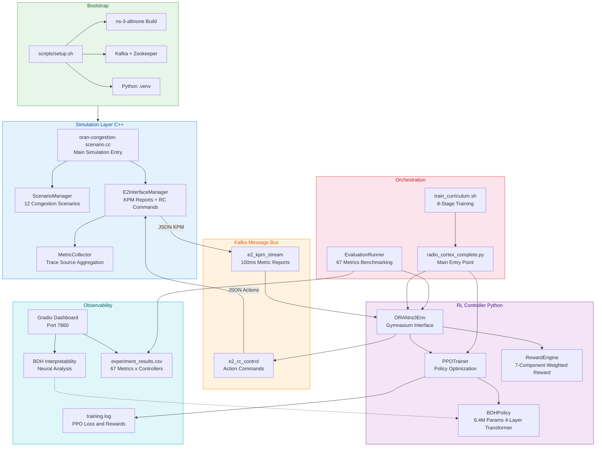
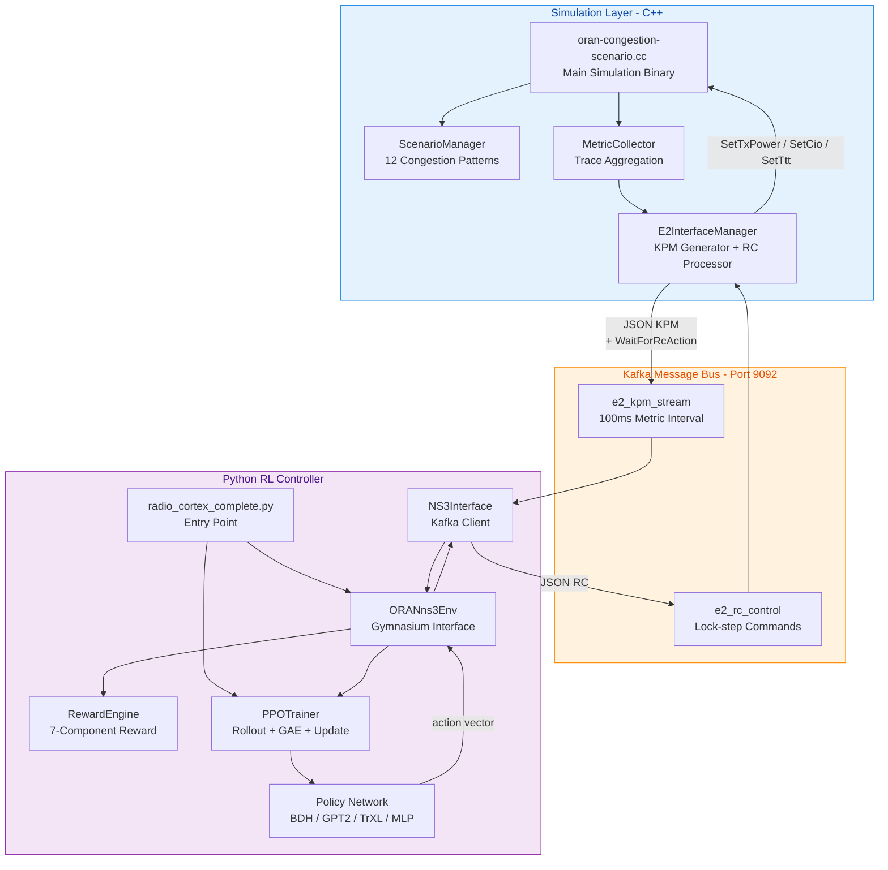
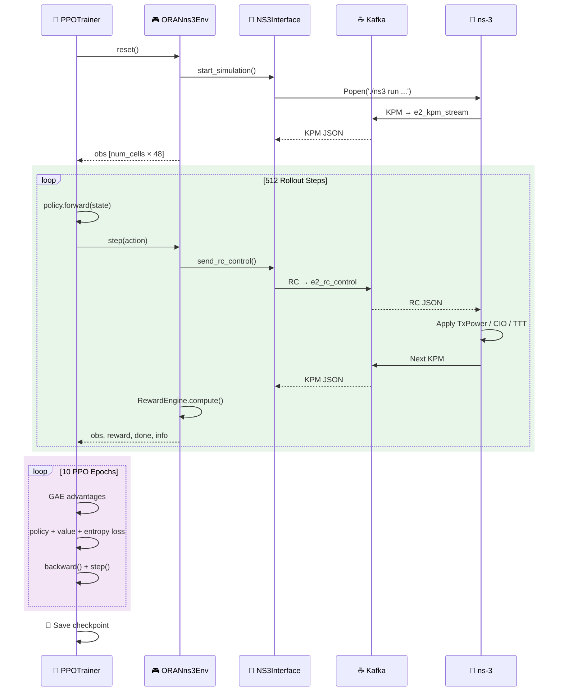

# Radio-Cortex: O-RAN Reinforcement Learning Congestion Control

Radio-Cortex is a closed-loop O-RAN congestion control system that uses Reinforcement Learning (RL) to dynamically optimize Radio Access Network (RAN) parameters. The system couples a high-fidelity ns-3 network simulation with a PPO-based RL controller via Apache Kafka, providing a complete digital twin environment for training and evaluating intelligent RAN optimization policies.

**Pre-trained weights available on Hugging Face:** [Radio-Cortex-ORAN](https://huggingface.co/niksixus/Radio-Cortex-ORAN/tree/main)

**Project Video:** [Radio-Cortex](https://youtu.be/ZvtCA4xGShE)

**Project Report:** [Report.pdf](./Report.pdf)

**Deployed at:** [Radio-Cortex](https://huggingface.co/spaces/niksixus/Radio-Cortex)

---

## Table of Contents

1. [Overview](#1-overview)
2. [Getting Started](#2-getting-started)
3. [Core Components](#3-core-components)
4. [Training System](#4-training-system)
5. [Evaluation & Benchmarking](#5-evaluation--benchmarking)
6. [Interpretability & Visualization](#6-interpretability--visualization)
7. [Advanced Topics](#7-advanced-topics)
8. [Complete Model Analysis](#8-complete-model-analysis)
9. [Advanced Workflows](#9-advanced-workflows)
10. [Demo & Screenshots](#10-demo--screenshots)
11. [Limitations & Future Scope](#11-limitations--future-scope)

---

## 1. Overview

### System Purpose and Design Goals

Radio-Cortex addresses the challenge of real-time RAN optimization under diverse congestion scenarios. Traditional static parameter configurations cannot adapt to dynamic network conditions such as flash crowds, mobility storms, or spectrum scarcity. Radio-Cortex trains RL agents to continuously adjust three critical parameters per cell:

| Parameter | Range | Purpose |
|-----------|-------|---------|
| **TxPower** | 10–46 dBm | Transmission power control for interference management |
| **CIO** (Cell Individual Offset) | −6 to +6 dB | Handover bias tuning for load balancing |
| **TTT** (Time-to-Trigger) | 0–1280 ms | Mobility robustness parameter to prevent ping-pong handovers |

The system is designed around four key principles:

1. **Lock-Step Synchronization** — The ns-3 simulation blocks waiting for RL actions, ensuring deterministic state transitions critical for stable training.
2. **E2 Interface Compliance** — Uses O-RAN E2 service models (E2SM-KPM for metrics, E2SM-RC for control) over Kafka for realistic message passing.
3. **Curriculum Learning** — Progressive introduction of 12 stress-test scenarios to build robust policies that generalize across congestion patterns.
4. **Interpretability** — The flagship BDH (Baby Dragon Hatchling) architecture exposes scale-free topology, sparse activation patterns, and concept-neuron correlations for explainable decision-making.

### What Insight BDH Reveals

The Baby Dragon Hatchling (BDH) architecture demonstrates that **Scale-Free Network Topology** and **Sparse Hebbian Routing** are highly effective for distributed multi-agent control environments like O-RAN. By eliminating fixed causal masking, BDH allows Base Stations to contextually attend to varying numbers of UEs without retraining. Live interpretability analysis proves that BDH naturally prunes up to 85% of its connections per timestep, relying on a small subset of "Hub Neurons" to integrate critical state information (e.g., congestion spikes) — mirroring the energy-efficient routing found in biological brains and preventing catastrophic forgetting during curriculum learning.

### High-Level System Architecture



### Key Components and Code Mapping

| Component | File/Class | Description |
|-----------|------------|-------------|
| **Main Entry Point** | `radio_cortex_complete.py::main()` | Argument parsing, mode selection (train/eval), orchestration |
| **Gymnasium Environment** | `oran_ns3_env.py::ORANns3Env` | Wraps ns-3 into OpenAI Gym interface with `reset()`, `step()`, state/action spaces |
| **NS3 Interface** | `oran_ns3_env.py::NS3Interface` | Low-level Kafka communication: `send_rc_control()`, `receive_kpm_report()`, `start_simulation()` |
| **Reward Function** | `oran_ns3_env.py::RewardEngine` | 7-component weighted reward: throughput, delay, loss, load, energy, SLA, CIO regularization |
| **PPO Trainer** | `rl_training_pipeline.py::PPOTrainer` | Rollout collection, GAE advantage computation, multi-epoch policy updates |
| **ns-3 Simulation** | `oran-congestion-scenario.cc` | C++ simulation entry point, scenario initialization |
| **Scenario Manager** | `oran-congestion-scenario.cc::ScenarioManager` | Loads and configures 12 congestion scenarios |
| **E2 Interface** | `oran-congestion-scenario.cc::E2InterfaceManager` | Generates KPM JSON, parses RC JSON, applies actions |
| **Metric Collector** | `oran-congestion-scenario.cc::MetricCollector` | Registers ns-3 trace sources, aggregates per-UE and per-cell metrics |
| **Evaluation Framework** | `evaluation_baseline.py::EvaluationRunner` | Executes episodes, collects 67 metrics, computes 6 composite scores |
| **Result Logger** | `evaluation_baseline.py::ResultLogger` | Appends results to `results/experiment_results.csv` |
| **Gradio Dashboard** | `gradio_app.py::create_interface()` | Multi-tab web interface for visualization and benchmarking |
| **BDH Interpretability** | `interpretability/bdh_interpretability_solo.py` | Scale-free topology, monosemanticity, sparsity, Hebbian plasticity analysis |
| **Interpretability Logger** | `interpretability/live_logger.py::InterpretabilityLogger` | Live logging during training for interpretability snapshots |
| **Interpretability Visualizer** | `interpretability/visualize.py` | Visualization utilities for interpretability results |
| **Interpretability Gradio Tab** | `interpretability/gradio_tab.py` | Gradio dashboard tab for interpretability |
| **Curriculum Trainer** | `scripts/train_curriculum.sh` | 8-stage progressive scenario introduction with maintenance dose mixing |

### 12 Congestion Scenarios

| Scenario | Code Identifier | Primary Challenge | Key Metric |
|----------|----------------|-------------------|------------|
| Flash Crowd | `flash_crowd` | Sudden user influx in one cell | Congestion Intensity |
| Mobility Storm | `mobility_storm` | High-speed cross-cell movement | Handover Success Rate |
| Traffic Burst | `traffic_burst` | Periodic application data surges | Peak Burst Loss |
| Handover Ping-Pong | `handover_ping_pong` | Boundary oscillation | Handover Count per UE |
| Sleepy Campus | `sleepy_campus` | Day/night traffic variation | Energy Efficiency |
| Ambulance | `ambulance` | Emergency priority stream | Priority UE Delay |
| Adversarial | `adversarial` | Rapid signal fluctuation | Stability Score |
| Commuter Rush | `commuter_rush` | Mass group handover (50+ UEs) | RACH Failure Rate |
| Mixed Reality | `mixed_reality` | VR + TCP slicing | Slice Isolation |
| Urban Canyon | `urban_canyon` | Building blockage | Recovery Time |
| IoT Tsunami | `iot_tsunami` | Massive device count (100+ UEs) | Scheduling Delay |
| Spectrum Crunch | `spectrum_crunch` | Multi-band carrier aggregation | Aggregate Throughput |

### 7 Policy Architectures

| Architecture | Code Class | Parameters | Key Feature |
|--------------|-----------|------------|-------------|
| **BDH** (Default) | `policies/bdh_policy.py::BDHPolicy` | 6.4M | Scale-free sparse Hebbian routing, interpretable |
| **GPT-2** | `policies/policy_gpt2.py::GPT2Policy` | 3.2M | Causal decoder-only transformer |
| **Transformer-XL** | `policies/policy_trxl.py::TrXLPolicy` | 3.2M | Segment-level recurrence |
| **Linear Transformer** | `policies/policy_linear.py::LinearPolicy` | 3.2M | O(T) kernel attention |
| **Universal Transformer** | `policies/policy_universal.py::UniversalPolicy` | 0.85M | Weight-shared depth |
| **Reformer** | `policies/policy_reformer.py::ReformerPolicy` | 3.2M | Bucketed LSH attention |
| **MLP Baseline** | `policies/neural_networks.py::ActorCritic` | 0.14M | 2-layer feedforward |

### File Organization

```
Radio-Cortex/
├── radio_cortex_complete.py         # Main orchestration script
├── oran_ns3_env.py                  # Gymnasium environment wrapper
├── rl_training_pipeline.py          # PPO trainer implementation
├── evaluation_baseline.py           # Evaluation runner and metrics
├── gradio_app.py                    # Web dashboard
├── vec_env_wrapper.py               # Vectorized environment wrapper
├── oran-congestion-scenario.cc      # ns-3 C++ simulation source
├── CMakeLists.txt                   # CMake build configuration
├── requirements.txt                 # Python dependencies
├── Report.pdf                       # Project report
├── scripts/
│   ├── setup.sh                     # One-shot environment bootstrap
│   ├── train_quick.sh               # Quick smoke test (100 steps)
│   ├── train_scenario.sh            # Single scenario training
│   ├── train_curriculum.sh          # 8-stage curriculum trainer
│   ├── start_kafka.sh               # Kafka/Zookeeper startup
│   ├── stop_kafka.sh                # Kafka/Zookeeper shutdown
│   ├── run_kafka_native.sh          # Native Kafka runner
│   ├── cleanup.sh                   # Cleanup script
│   ├── eval_bdh_all_scenarios.sh    # BDH evaluation across all scenarios
│   └── log_analyzer.go              # Log analysis utility (Go)
├── policies/
│   ├── __init__.py                  # Policy factory (get_policy)
│   ├── bdh.py                       # BDH core module
│   ├── bdh_policy.py                # Baby Dragon Hatchling policy
│   ├── policy_gpt2.py               # GPT-2 style transformer policy
│   ├── policy_trxl.py               # Transformer-XL policy
│   ├── policy_linear.py             # Linear attention transformer policy
│   ├── policy_universal.py          # Universal transformer policy
│   ├── policy_reformer.py           # Reformer policy
│   └── neural_networks.py           # MLP baseline (ActorCritic)
├── interpretability/
│   ├── __init__.py                  # Interpretability package init
│   ├── bdh_interpretability_solo.py # BDH interpretability analysis
│   ├── live_logger.py               # Live interpretability logging
│   ├── visualize.py                 # Visualization utilities
│   └── gradio_tab.py                # Gradio dashboard tab
├── ui/
│   ├── index.html                   # Web UI entry point
│   ├── styles.css                   # Web UI styles
│   └── pages/                       # Additional UI pages
├── docs/                            # Documentation and images
├── bdh_results/                     # BDH interpretability result data
├── models/                          # Trained checkpoints (.pt files)
├── results/                         # Evaluation CSV outputs
├── logs/                            # Training logs, action logs, ns-3 output
├── .venv/                           # Python virtual environment
└── ns-3-allinone/                   # ns-3 simulation framework
```

### Getting Started (Quick Reference)

1. **Setup:** Run `bash scripts/setup.sh` to install all dependencies
2. **Quick Test:** Validate installation with `bash scripts/train_quick.sh`
3. **Training:** Launch full curriculum with `bash scripts/train_curriculum.sh`
4. **Evaluation:** Benchmark against baseline with `python3 radio_cortex_complete.py --mode eval --model base`
5. **Visualization:** Launch dashboard with `python3 gradio_app.py` → `http://localhost:7860`

---

## 2. Getting Started

### Prerequisites

Radio-Cortex requires a Linux environment (Ubuntu 20.04+ or Debian-based distributions recommended):

| Component | Requirement | Purpose |
|:----------|:------------|:--------|
| **OS** | Ubuntu 20.04+ / Debian | ns-3 build compatibility |
| **CPU** | 4+ cores recommended | Parallel environment training |
| **RAM** | 8 GB minimum, 16 GB+ recommended | ns-3 compilation and vectorized envs |
| **Python** | 3.8+ | RL training pipeline |
| **Disk Space** | 10 GB free | ns-3 build artifacts, Kafka logs, model checkpoints |
| **Java** | JRE 11+ | Kafka and Zookeeper runtime |
| **sudo access** | Optional but recommended | System package installation |

### Setup

Radio-Cortex includes a fully automated setup script that handles all dependencies, building, and Kafka configurations.

```bash
# 1. Clone the Repository
git clone https://github.com/ishreyanshkumar/Radio-Cortex.git
cd Radio-Cortex

# 2. Run the End-to-End Setup Script
bash scripts/setup.sh
```

The `setup.sh` script orchestrates four sequential phases:


> **Note:** The ns-3 build phase uses all CPU cores and may take 10–20 minutes. Any simulations run during this time will execute very slowly due to CPU starvation.

**Critical Configuration Flags for ns-3:**
- `-d optimized` — Enables O3 optimization, 10–20× faster than default
- `--disable-modules=lorawan,nr` — Reduces compile time by excluding unused modules

### Kafka Setup Details

Kafka provides asynchronous messaging between ns-3 (E2 Node) and the RL agent (Near-RT RIC):
- The script checks for existing installation, downloads Kafka 2.13-3.6.1 if missing
- Cleans `/tmp/kafka-logs` and `/tmp/zookeeper`
- Starts Zookeeper (port 2181) then Kafka Broker (port 9092)
- Polls TCP port 9092 for 30 seconds to confirm broker readiness

### Starting Kafka After Reboot

```bash
bash scripts/start_kafka.sh
```

### Quick Smoke Test

```bash
source .venv/bin/activate
bash scripts/train_quick.sh
```

The smoke test runs 100 timesteps end-to-end. Expected results:

| Step | Component | Expected Output |
|:-----|:----------|:----------------|
| 1 | ns-3 subprocess spawn | `ns3_out_*.log` appears in `logs/` |
| 2 | Kafka connection | No connection errors in console |
| 3 | KPM message reception | `Received KPM report: {...}` in logs |
| 4 | Policy forward pass | `Action sent: [...]` in console |
| 5 | Training metrics | `timesteps: 100, reward: ...` printed |
| 6 | Checkpoint save | `models/radiocortex_bdh.pt` created |

### Directory Structure After Setup

```
Radio-Cortex/
├── .venv/                           # Python virtual environment
├── ns-3-allinone/
│   └── ns-3.*/
│       ├── build/                   # Compiled binaries
│       └── scratch/                 # Linked scenario files
├── kafka_2.13-3.6.1/               # Apache Kafka installation
├── logs/                            # Runtime logs
├── models/                          # Saved model checkpoints
└── results/                         # Evaluation CSV outputs
```

### Troubleshooting

**ns-3 Build Failures:**
```bash
g++ --version         # Requires g++ 9.0+
sudo apt-get install g++ cmake python3-dev
cd ns-3-allinone/ns-3.*/
./ns3 clean && ./ns3 configure -d optimized && ./ns3 build
```

**Kafka Connection Issues:**
```bash
ps aux | grep kafka
netstat -tuln | grep 9092
pkill -f kafka && sleep 5 && bash scripts/start_kafka.sh
```

**Python Dependency Conflicts:**
```bash
rm -rf .venv
python3 -m venv .venv
source .venv/bin/activate
pip install --upgrade pip setuptools wheel
pip install -r requirements.txt
```

---

## 3. Core Components

### System Architecture

Radio-Cortex implements a three-tier architecture: the ns-3 simulation provides ground truth network behavior, Kafka provides asynchronous message passing with lock-step synchronization, and the Python layer implements the RL controller with pluggable policy architectures.



### ns-3 Simulation Layer

The ns-3 simulation (`oran-congestion-scenario.cc`) implements the digital twin of an O-RAN compliant Radio Access Network.

**Key Responsibilities:**
- **`ScenarioManager`** — Selects and configures one of 12 pre-defined congestion scenarios
- **`MetricCollector`** — Registers trace sources on ns-3 objects, aggregates per-UE metrics into per-cell statistics
- **`E2InterfaceManager`** — Implements the O-RAN E2 interface by generating KPM reports at 100ms intervals and processing RC commands
- **Kafka Integration** — Uses librdkafka C++ bindings to send/receive JSON messages, blocks simulation at `WaitForRcAction()` to enforce lock-step execution

**Critical Synchronization:** The simulation blocks at `WaitForRcAction()` after producing each KPM message, ensuring it does not advance until receiving an RC command. This makes state transitions deterministic and reproducible.

### Message Bus Layer (Kafka)

Two topics implement the bidirectional E2 interface:

| Topic | Direction | Content | Interval |
|-------|-----------|---------|----------|
| `e2_kpm_stream` | ns-3 → Python | KPM JSON (per-UE + per-cell metrics) | 100ms |
| `e2_rc_control` | Python → ns-3 | RC JSON (TxPower, CIO, TTT per cell) | On-demand |

**Topic Isolation for Parallel Environments:** When running vectorized environments (`--n-envs > 1`), each environment appends a `topic_suffix` (e.g., `_1`, `_2`) to the topic names, creating isolated communication channels. This enables parallel simulation instances without message crosstalk.

### Python RL Controller Layer

#### ORANns3Env (`oran_ns3_env.py`)

The `ORANns3Env` class implements the Gymnasium `Env` interface:

- **Observation Space:** `Box(shape=(num_cells, 48), dtype=np.float32)` — 3-frame stacked cell-level features normalized to [−1, 1]
- **Action Space:** `Box(shape=(num_cells, 3), dtype=np.float32, low=-1, high=1)` — Normalized TxPower, CIO, TTT per cell
- **`step(action)`** — Sends RC control to ns-3, receives next KPM report, computes reward
- **`reset()`** — Starts a new episode, returns initial observation
- **`close()`** — Terminates ns-3 subprocess and Kafka consumers

#### NS3Interface (`oran_ns3_env.py`)

- **`start_simulation(scenario, config)`** — Spawns ns-3 subprocess via `subprocess.Popen()`
- **`send_rc_control(actions)`** — Serializes action array to JSON, publishes to `e2_rc_control`
- **`receive_kpm_report(timeout=5000)`** — Polls `e2_kpm_stream`, parses JSON into Python dict, handles frame stacking

#### RewardEngine (`oran_ns3_env.py`)

7-component weighted reward (stationary, single-stage, optimized for SubprocVecEnv):

| Component | Weight | Formula | Range |
|:----------|:------:|:--------|:-----:|
| **Throughput** | 8.0 | $W \cdot \log(1 + T/T_{max})$ | [−0.5, 50.0] |
| **Delay** | 4.0 | $-W \cdot \min(D/D_{max}, 1)$ | [−50.0, 0.0] |
| **Packet Loss** | 8.0 | $-W \cdot (\text{mean loss} \cdot 4)$ | [−25.0, 0.0] |
| **Load Balance** | 4.0 | $-\text{std}(\text{cell loads}) \cdot W$ | [−2.0, 0.0] |
| **Energy Eff.** | 0.1 | $-\text{mean}(\text{norm tx power}) \cdot W$ | [−1.0, 0.0] |
| **SLA Bonus** | 0.5 | +0.5 per UE meeting SLA (>1 Mbps, <100 ms) | [0.0, +NumUEs×0.5] |
| **CIO Regularization** | 0.4 | $-W \cdot \text{mean}(\|CIO\|/6)$ | [−0.4, 0.0] |
| **Survival Bias** | — | Constant +1.0 | — |

$$R_{total} = \text{clip}(r_{tput} + r_{delay} + r_{loss} + r_{load} + r_{energy} + r_{sla} + r_{cio} + 1.0,\ [-100,\ 50])$$

#### PPOTrainer (`rl_training_pipeline.py`)

- **Rollout Collection** — Executes `rollout_steps` (default 512) timesteps across `n_envs` parallel environments
- **GAE Computation** — Generalized advantage estimates with λ=0.95
- **Policy Update** — 10 epochs over mini-batches (batch_size=512), optimizing clipped surrogate + value loss + entropy bonus
- **Gradient Clipping** — `max_grad_norm=0.5`
- **Mixed Precision** — BFloat16 AMP with `torch.cuda.amp.autocast()` on CUDA

### Policy Network Architectures

All policies share the same actor-critic interface: `forward(state)` → `(action_mean, action_logstd, value)`. All use **state-dependent exploration** (learned log-std heads).

| Model ID | Architecture | Parameters | Hidden Dim | Key Features |
|:---------|:-------------|:-----------|:-----------|:-------------|
| `bdh` | Baby Dragon Hatchling | 6.4M | 512 | Scale-free topology, sparse Hebbian routing, 4-layer transformer |
| `gpt2` | GPT-2 Style Transformer | 3.2M | 256 | Causal attention, positional embeddings |
| `linear` | Linear Transformer | 3.2M | 256 | O(T) kernel attention (Katharopoulos) |
| `reformer` | Reformer | 3.2M | 256 | Bucketed attention, 128 token context |
| `trxl` | Transformer-XL | 3.2M | 256 | Segment-level recurrence |
| `universal` | Universal Transformer | 851K | 256 | Weight-tied blocks, depth embeddings |
| `nn` | MLP Baseline (ActorCritic) | 140K | 256 | 2-layer feed-forward network |

**BDH Architecture Specifics:**
- Frame Encoding: Projects 48-dim cell features to 128-dim embeddings
- 4-Layer Transformer Stack: Sparse attention (4 heads × 128 dim) + MLP with element-wise multiplication
- Scale-Free Routing: Hub neurons (15% of neurons) route 85% of information
- Sparse Activation: 60–85% of neurons inactive per forward pass
- Independent output heads: actor mean (9-dim), actor log-std (learnable), critic value (1-dim)

### Training Step Sequence



---

## 8. Complete Model Analysis

This section provides a comprehensive analysis of the reinforcement learning models found in the `models/` directory. The metadata (parameter counts, training steps, layer architectures) is extracted **directly from the `.pt` checkpoint files** rather than relying on prior documentation.

### 📊 Summary Table

| Model | File Size (MB) | Total Params | Timesteps Trained | Hidden Dim | Architecture |
| :--- | :--- | :--- | :--- | :--- | :--- |
| **BDH** | 72.94 | 6,418,451 | 983,040 | 512 | BDH |
| **GPT2** | 36.96 | 3,234,323 | 1,000,000 | 256 | GPT-2 Style Transformer |
| **LINEAR** | 36.89 | 3,217,939 | 1,000,000 | 256 | Linear Attention Transformer |
| **REFORMER** | 37.05 | 3,232,019 | 1,000,000 | 256 | Reformer Transformer |
| **TRXL** | 36.62 | 3,195,155 | 1,000,000 | 256 | Transformer-XL |
| **UNIVERSAL** | 9.73 | 851,475 | 1,000,000 | 256 | Universal Transformer |
| **NN** | 1.62 | 140,563 | 1,000,000 | 256 | 2-layer MLP Baseline |

### 🔬 Per-Model Detailed Metadata

#### 1. BDH 
- **Total Parameters:** 6,418,451
- **Timesteps Trained:** 983,040
- **Hyperparameters:**
  - `hidden_dim`: 512
  - `lr`: 3e-05 (stable learning rate config)
  - `batch_size`: 512, `rollout_steps`: 512, `n_envs`: 48
  - `clip_epsilon`: 0.1, `vf_coef`: 1.0
  - Entropy annealing: `ent_coef_start`: 0.03 → `ent_coef_end`: 0.005 (`ent_decay_fraction`: 0.8)
- **Key Architecture Characteristics:**
  - Uses an independent `logstd_head`: [1, 9] mapped to 9 action spaces.
  - Scale-free slot-based memory mapping inside the `encoder`: [4, 128, 4096] (4 heads, 128 dim, 4096 keys) and `decoder`: [16384, 128].

#### 2. GPT2
- **Total Parameters:** 3,234,323
- **Timesteps Trained:** 1,000,000 
- **Hyperparameters:** `hidden_dim`: 256, `lr`: 0.0005, `batch_size`: 512, `rollout_steps`: 512, `n_envs`: 48
- **Key Architecture Characteristics:**
  - `pos_embed`: [1, 64, 256] contextual sequence embedding for sequential state representations.
  - State projection block utilizes an initialized size of `state_embed.weight` [256, 144].

#### 3. LINEAR (Linear Attention Transformer)
- **Total Parameters:** 3,217,939
- **Timesteps Trained:** 1,000,000 
- **Hyperparameters:** `hidden_dim`: 256, `lr`: 0.0005, `batch_size`: 512, `rollout_steps`: 512, `n_envs`: 48
- **Key Architecture Characteristics:**
  - Standard autoregressive linear attention mechanisms. Identical input mapping block to the GPT2 backbone via `pos_embed`: [1, 64, 256] and `state_embed.weight`: [256, 144]. 

#### 4. REFORMER
- **Total Parameters:** 3,232,019
- **Timesteps Trained:** 1,000,000 
- **Hyperparameters:** `hidden_dim`: 256, `lr`: 0.0005, `batch_size`: 512, `rollout_steps`: 512, `n_envs`: 48
- **Key Architecture Characteristics:**
  - Designed for much longer context sequence history. 
  - Notable distinction in position embedding sequence length - `pos_embed`: [1, 128, 256] (128 context tokens compared to 64 for GPT2/Linear)
  - Also utilizes independent `actor_logstd`: [1, 9] for log-based standard deviation bounding.

#### 5. TRXL (Transformer-XL)
- **Total Parameters:** 3,195,155
- **Timesteps Trained:** 1,000,000 
- **Hyperparameters:** `hidden_dim`: 256, `lr`: 0.0005, `batch_size`: 512, `rollout_steps`: 512, `n_envs`: 48
- **Key Architecture Characteristics:**
  - Standard TrXL blocks without hardcoded positional embeddings natively printed, but features the standard projection mappings such as `state_embed.weight`: [256, 144] and independent `actor_logstd`: [1, 9]. 

#### 6. UNIVERSAL (Universal Transformer)
- **Total Parameters:** 851,475
- **Timesteps Trained:** 1,000,000 
- **Hyperparameters:** `hidden_dim`: 256, `lr`: 0.0005, `batch_size`: 512, `rollout_steps`: 512, `n_envs`: 48
- **Key Architecture Characteristics:**
  - Uniquely features a fraction of the parameter count relative to other Transformer variants due to **weight-tied blocks** across depth.
  - Implements recurrent depth embeddings (`step_embed.weight`: [4, 256]) for depth conditioning. Uses standard `pos_embed`: [1, 64, 256].

#### 7. NN (MLP Baseline)
- **Total Parameters:** 140,563
- **Timesteps Trained:** 1,000,000
- **Hyperparameters:** `hidden_dim`: 256, `lr`: 0.0005, `batch_size`: 512, `rollout_steps`: 512, `n_envs`: 48
- **Key Architecture Characteristics:**
  - The lightest model mapping observations using simple dense mappings (`feature_net.0.weight`: [256, 144] and `feature_net.2.weight`: [256, 256]) then linearly mapped independently to an `actor_mean` [9, 256] vector.

---

## 9. Advanced Workflows

### Scenario Curriculum (8-Stage "Lean Power Suite")
The curriculum script trains on progressively harder scenarios with automated inter-stage storage cleanup.

```bash
# Start the full 8-stage curriculum
bash scripts/train_curriculum.sh

# Resume from a specific stage (e.g., Stage 5)
bash scripts/train_curriculum.sh --start 5
```

**Core Principle**: Gradual introduction of complexity while maintaining exposure to mastered scenarios to prevent **catastrophic forgetting**.

**Key Strategy**: 
- Start with 100% on easiest scenario (Flash Crowd).
- Add new scenarios progressively via weighted mixing.
- Keep exposure to previous scenarios as a "maintenance dose".
- Focus majority of training on the newest/hardest targets.

| Stage | Focus | Total-timesteps | Skill Description |
|:---:|:---:|:---:|:---|
| 1 | Flash Crowd | 400k | Basic load balancing (Bootstrap) |
| 2 | Sleepy Campus | 450k | Energy efficiency (Green RAN) |
| 3 | Urban Canyon | 500k | Signal recovery & Robustness |
| 4 | Mobility Storm | 550k | Handover Optimization |
| 5 | Traffic Burst | 600k | Congestion Management |
| 6 | Ambulance | 650k | QoS Priority & Slicing |
| 7 | Spectrum Crunch | 700k | Spectral Efficiency |
| 8 | Generalization Mix | 1000k | Multi-goal Mastery |

**Total: ~1M timesteps** to full multi-domain mastery. *(Note: Test `ping_pong` and `iot_tsunami` for zero-shot generalization after training)*

---

## 10. Demo & Screenshots

### 🎬 System Walkthrough Video
https://youtu.be/ZvtCA4xGShE

### 📉 Evaluation Dashboard


### 🧠 BDH Interpretability Dashboard


### 📊 ModelBench Tradeoff Analysis


---

## 11. Limitations & Future Scope

**Current Limitations:**
*   **ns-3 Simulation Overhead:** The environment relies on a high-fidelity ns-3 simulation which is CPU-intensive. Real-time factor is limited by single-core ns-3 performance (though vectorized envs alleviate this during training).
*   **Action Space Discretization:** While the action space is continuous, mapping continuous outputs to discrete hardware configurations (like specific MCS indices) requires strict bounding that can occasionally saturate gradients if not tuned perfectly.
*   **Simplified E2 Interface:** The Kafka bridge is a functional proxy for the E2 interface but does not implement the full ASN.1 encoding overhead of a production O-RAN RIC.

**Future Scope:**
*   **Multi-Agent RL (MARL):** Transitioning from a single centralized agent to distributed agents at each eNodeB cell.
*   **Hardware-in-the-Loop (HIL):** Testing the trained BDH policy on physical SDRs (Software Defined Radios) using srsRAN or OpenAirInterface.
*   **Energy-Saving State Support:** Integrating deep sleep and MIMO antenna blanking into the action space for true Green-RAN optimization.
*   **Zero-Shot Generalization:** Expanding the curriculum to train across varying spectrum bands simultaneously.