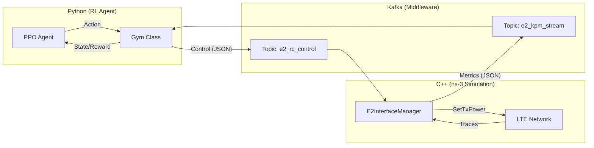

# Radio-Cortex: O-RAN RL Congestion Control

Radio-Cortex is a closed-loop control system that uses Reinforcement Learning (RL) to optimize network parameters (Tx Power) in an O-RAN compliant ns-3 simulation. It demonstrates a real-time feedback loop where an RL agent (PPO) receives KPM (Key Performance Metrics) from ns-3 via Kafka and sends back RC (RAN Control) actions.

## 🚀 Quick Start

### 1. Prerequisites
- Linux OS
- Python 3.10+
- ns-3 (v3.46.1) with dependent modules
- Apache Kafka (v3.6.1)

### 2. Build ns-3
Compile the C++ simulation scenario.
```bash
cd ns-allinone-3.46.1/ns-3.46.1
./ns3 build
```

### 3. Start Kafka
Start Zookeeper and Kafka brokers using the provided script.
```bash
./start_kafka.sh
```

### 4. Stop Kafka
Stop the background processes when finished.
```bash
./stop_kafka.sh
```

### 5. Run Training
Start the RL training loop. This launches the Python agent, which in turn spawns the ns-3 simulation process.
```bash
python3 radio_cortex_complete.py --mode train
```

---

## 📂 Codebase Structure & Documentation

### 1. `radio_cortex_complete.py`
**Role:** Main Entry Point & Orchestrator.
This script manages the lifecycle of the training process, initializes the agent, and runs the main loop.

*   **`main()`**: Entry point. Parses arguments (`--mode train/eval/demo`) and routes execution.
*   **`train_radio_cortex(config, ...)`**: The core training loop.
    *   Creates the environment (`create_oran_env`).
    *   Initializes the `PPOTrainer`.
    *   Executes the training steps (rollout collection -> policy update).
    *   Saves the model to `models/radio_cortex.pt`.
*   **`RadioCortexAgent`**: High-level agent class.
    *   `get_rl_action()`: Queries the neural network for an action.
    *   `_heuristic_action()`: Fallback logic rule if RL is disabled.

### 2. `oran_ns3_env.py`
**Role:** Gymnasium Environment Wrapper.
converts ns-3 simulation into a standard OpenAI Gym interface (observation, action, reward).

*   **`ORANns3Env`**: The Gym Environment class.
    *   `step(action)`: Takes an RL action, sends it to ns-3, waits for the next KPM report, and returns (state, reward, done).
    *   `reset()`: Restarts the ns-3 simulation subprocess.
    *   `_compute_reward(e2_msg)`: Calculates reward based on Throughput (Log utility), Delay, and Fairness.
*   **`NS3Interface`**: Handles low-level communication.
    *   `start_simulation()`: Spawns the `./ns3 run ...` subprocess.
    *   `send_rc_control(actions)`: Serializes actions to JSON and sends via Kafka `e2_rc_control` topic.
    *   `receive_kpm_report()`: Polls Kafka `e2_kpm_stream` topic for metrics.

### 3. `rl_training_pipeline.py`
**Role:** Reinforcement Learning Algorithms (PPO).
Implements the PPO algorithm from scratch using PyTorch.

*   **`ActorCritic`**: The Neural Network architecture.
    *   `Actor`: Maps state -> action (Gaussian distribution).
    *   `Critic`: Maps state -> value estimate.
*   **`PPOTrainer`**: Implementation of PPO logic.
    *   `collect_rollout()`: Interacts with the env to gather a batch of experiences.
    *   `compute_gae()`: Calculates Generalized Advantage Estimation for stable learning.
    *   `update_policy()`: Performs the Gradient Descent update steps on the Actor and Critic networks.

### 4. `oran-congestion-scenario.cc`
**Role:** ns-3 Simulation Scenario (C++).
The "Digital Twin" of the RAN. Implements the LTE/5G network, traffic generation, and E2 interface.

*   **`E2InterfaceManager`**: Manages the Kafka bridge.
    *   `SetupKafka()`: Configures `librdkafka` producer/consumer.
    *   `SendKpmReport()`: Collects metrics from all UEs, formats as JSON, and produces to Kafka.
    *   `ProcessRcCommand()`: Parses JSON control messages and applies changes (e.g., `SetTxPower`) to eNodeBs.
*   **`MetricCollector`**: Aggregates simulation traces.
    *   `ReportDlScheduling()`: Callback for DL MAC activity (estimates RB usage).
    *   `ReportAppRx()`: Callback for packet reception (calculates Delay).
    *   `GetAndResetUeMetrics()`: Returns accumulated stats and resets counters.

---

## 🔄 System Architecture


